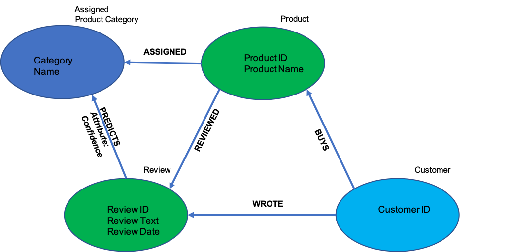

# Practical Guide: Using Product Reviews to Support Internal Customer Operations


## Overview

In the following blog post, we're going to explore how to use AWS to scale data science experiments, with a particular focus on building Natural Language Processing (NLP) models to support different functions within an organisation.

This blog post is accompanied by a series of Amazon SageMaker notebooks (which can be find in [this repo] which provide the step-by-step workflow to use very large text datasets for operational purposes, mainly, how to use historical online product customer review data in order to provide predictive capability for identifying product categories, and recommend similar products.

**Use Case Introduction**

The Use Case which will underpin this blog post concerns building a customer support solution, based on customer product reviews [data](https://registry.opendata.aws/amazon-reviews/). Whilst there are many different use cases which can be based on such data, we're going to be focusing on how to use a variety of NLP techniques to help optimize the core functions of an Organisations Customer Support unit. As part of this journey, we're going to navigate this project using a data science framework, which involves data cleansing and preparation, exploration and insights, modelling, scaling, and then operationalization. 

There are several scenarios in which we can explore for this use case, below lists just three which are possible:

 - Incorrect product reviews: customer reviews which are associated with the wrong product can be a time consuming task to track, especially when using manual processes (e.g. Human QA workflows). We can develop automatic processes to predict whether the review added for a specific product (or category of product) is correct, helping reduce some of the human overheads required to support this.
 - Product Categorization - The correct assignment of the product category has several consequences, from technical consequences such as wrongly indexing thus affecting recommendations, to balancing internal product catalogues from a operational perspective. Whilst we can use keywords within the product listing itself to derive the product category, we can also use customer reviews to ensure that the assigned category is suitable, or needs adjusting.
 - Decreasing Product Rating - Reviews could be considered as a good proxy of the sentiment of a product (or category of products), and although we have a star rating with many review systems, the shift in language of a review can help detect if the quality of a product is changing. One technique will be to examine whether the language is shifting overtime.
 
Whilst in this demonstration we're not going to cover all of the use case scenarios, we'll ensure that the solution that we develop is extensible and generalizable to enable more scenarios to be added going forward. 

**Services/Technologies Used**

The use case will use a range of AWS services and technologies, and demonstrate how an organisation can orchastrate different services into a operationalized architecture.

- AWS Glue
- Amazon SageMaker
- Amazon Neptune 
- AWS Lambda

**Tools**
- Spark / PySpark
- TF-IDF 
- Word2Vec / BlazingText
- BERT
- Ruruki (graph database)
- Pyviz


**Contents**

- [Data Preparation](#data-preparation) - How to use AWS Glue and SPARK to prepare and process large datasetes ready for analysis
- [Data Experimentation](#data-experimentation) - Using Amazon Sagemaker to construct a representative sample of our dataset, and inspect the characteristics of our data. 
    - Representative Sampling
    - Descriptive Analysis
- [Model Experimentation](#model-experimentation) - Using Amazon SageMaker's built in Algorithms, we'll apply some simple modelling techniques, and then determione which data partitioning / features work best for our tasks.
    - TF-IDF
    - Word Embeddings
    - Transformers
- [Modelling Scaling](#scaling-models) - Based on the model experiments, we'll scale up the model which yields the most suitable results for our use case
    - Word2Vec: Scaling to 150 million records
- [Graphing Data](#graphing-data) - Once we've established the correct models to acheive our predictive tasks, we need to find a way to structure our data to address some of the initial asks within the use case defined at the start of the project.
- [Testing Framework](#testing-framework) - One of the critical aspects of introducting a new process within an organisation is to ensure we can test and evaluate our processes when in an operationalized state. This will involve some form of split testing. 
- [Operationalizing](#operationalizing) - Finally, we need to define an architect for our solution in order to ensure we can deploy the solution which can be scaled across an organisation. We'll explore the use of Serverless services such as AWS Lambda and Step Functions to achieve this.


(#data-preparation) 
## Data Preparation

Let's first take a look at the data we're going to be using for this Use Case.


### Dataset Details  

> Amazon Customer Reviews (a.k.a. Product Reviews) is one of Amazon’s iconic products. In a period of over two decades since the first review in 1995, millions of Amazon customers have contributed over a hundred million reviews to express opinions and describe their experiences regarding products on the Amazon.com website. This makes Amazon Customer Reviews a rich source of information for academic researchers in the fields of Natural Language Processing (NLP), Information Retrieval (IR), and Machine Learning (ML), amongst others. Accordingly, we are releasing this data to further research in multiple disciplines related to understanding customer product experiences. Specifically, this dataset was constructed to represent a sample of customer evaluations and opinions, variation in the perception of a product across geographical regions, and promotional intent or bias in reviews.

Let's just take a look at what the tablular form of the data looks like to get an understanding of what we're working with.


|marketplace|customer_id|review_id     |product_id|product_parent|product_title                                                                        |product_category|star_rating|helpful_votes|total_votes|vine|verified_purchase|review_headline             |review_body|review_date|
|-----------|-----------|--------------|----------|--------------|-------------------------------------------------------------------------------------|----------------|-----------|-------------|-----------|----|-----------------|----------------------------|-----------------------------------------------------------------------------------------------------------------------------------------------------------------------------------------------------------------------------------------------------------------------------------------------------------------------------------------------------------------------------------------------------------------------------------------------------------------------------------------------------------------------------------------------------------------------------------------------------------------------------------------------------------------------------------------------------------------------------------------------------------------------------------------------------------------------------------------------------------------------------------|-----------|
|US         |22480053   |R28HBXXO1UEVJT|0843952016|34858117      |The Rising                                                                           |Books           |5          |0.0          |0.0        |N   |N                |Great Twist on Zombie Mythos|I've known about this one for a long time, ... |2012-05-03 |
|US         |44244451   |RZKRFS2UUMFFU |031088926X|676347131     |Sticky Faith Teen Curriculum with DVD: 10 Lessons to Nurture Faith Beyond High School|Books           |5          |15.0         |15.0       |N   |Y                |Helpful and Practical       |The student curriculum was better than I expected. The ...|2012-05-03 |
|US         |20357422   |R2WAU9MD9K6JQA|0615268102|763837025     |Black Passenger Yellow Cabs: Of Exile And Excess In Japan                            |Books           |3          |6.0          |8.0        |N   |N                |Paul                        |I found \\"Black Passenger / Yellow Cabs\\" to be a very readable book ... |2012-05-03 |


As we can see from the data table extract above, we have a variety of fields which can be used to filter across, as well as use as features for different analytical insights. 

As with the majority of data science projects which are driven with an underlying business objective, it's important to focus on what information/attributes are goingt to provide the most value and insights to the task at hand. However, selecting such data points, groupings, or segments in the data requires a delicate balance of initial inspection and analysis, hypothesis forming and prooving, as well as a strong level of domain expertise. 

For the purpose of our use case, we're going to initially focus our efforts on several of the attributes in this dataset:

- prodict_cateogry - this represents the higher-order category that a product is assigned to (e.g. Books, Electronics), we will inspect the data to determine how many categories there are (from the dataset description, we can see that they are not extremely granular, which may be useful if we're building multi-class classifiers
- review_body - The main text of the review. This is written by a customer, and describes the customer's feedback and opinion of the product. The review body will be the main feature used in our NLP and classificationt tasks.
- review_date - The date the review was added. This will be useful as we may want to construct temporal views of our data based ont the time it was generated.


### Data Preparation

As we're going to be working with a very large dataset, using the right tool is going to be essential here to view, process, and transform our data to a structure that's suitable for our purpose. We're going to use [AWS Glue](https://aws.amazon.com/glue/) as our environment to process our data, and by doing so, we will be able to use Apache SPARK to process our data. 

For those that are not familar with Apache SPARK, it's simply a large-scale data processing platform/engine, which provides a scalable environment to run very large processing and analytics workloads in. For more details on Spark, see [here](https://spark.apache.org/).

If we navigate to our [Pre-Processing Notebook](), we can see it looks exactly the same as a SageMaker Jupyter Notebook, and that's because it is. The great thing about AWS Glue is that it uses SageMaker Notebooks as the environment to perform your Spark operations; the only difference is that when using AWS Glue, we need to attach a Spark endpoint to a given notebook environment.

Before you can run this notebook, you'll need to have set up your own AWS Glue service via the AWS Console, which will involve configuring your 'Dev Endpoint', and your Notebooks linked to the Dev Endpoint. For more information on setting up your environment, see [here](https://docs.aws.amazon.com/glue/latest/dg/getting-started.html).


**Important Note**: As we're going to be initially working with Spark and AWS Glue, I would recommend creating your Glue Notebook Instance to begin with, and then cloning this repository into your AWS Glue Notebook environment. Once you've completed the Spark processing, it's important to shut down the Dev Endpoint, as this is charged not by usage, but uptime. Your Notebook Instance will still be active after you shutdown your Dev Endpoint, as these are decoupled services.


#### Importing Data and Processing

Our initial workflow is going to involve importing the data from the originating S3 bucket, and then loading it from a Spark RDD, into a PySpark Dataframe so we can process some of the text fields. We could leave it as a RDD, but for easier understanding and alignment with those familar with Pandas DataFrames, we'll use PySpark DataFrames.

```python
reviews = spark.read.parquet("s3://amazon-reviews-pds/parquet")

MIN_SENTENCE_LENGTH_IN_CHARS = 5
MAX_SENTENCE_LENGTH_IN_CHARS = 5000

df = reviews \
  .distinct() \
  .filter("marketplace = 'US'") \
  .withColumn('body_len', F.length('review_body')) \
  .filter(F.col('body_len') > MIN_SENTENCE_LENGTH_IN_CHARS) \
  .filter(F.col('body_len') < MAX_SENTENCE_LENGTH_IN_CHARS) \

record_count = df.count()
print('Total Record Processing: {}'.format(record_count))
```

In the code snippit above, we're simply reading the Amazon Reviews data from Parquet format into our Spark cluster, and then converting it to a PySpark Dataframe, with some simple filters on the length of the length of the review_body text. We do this as we want to ensure that we are working with rows where the reviews are present, and are not the length of several pages. A more robust approach here would be to first select all the reviews, calculate the variance in review_body length, and then use some a suitable range based on some St.d value or orther property.

The output of our processing results in the following:

```sh
Total Record Processing: 148,739,853
```

Depending on the size of the AWS Glue End-point, the processing time will vary. I chose 10 DPUs and it took around 15 minutes.

Next, we're going to process the `review_body` column data, as we want to ensure it is cleaned and ready for use for different NLP tasks. If you've had any experience with text processing for data mining or NLP tasks, then removing terms and tokenizing is typically the first step to readying your data. We're goign to perform some basic stop word removal, stemming, and tokenizing and then add these new filtered reviews to a new column.

In order to make use of Spark's distributed processing capabilities, rather than using `apply` and `lambda` functions on a standard dataframe which executes iteratively (not compute efficient at all!), we're goign to use the `withColumn` pySpark method, and apply several functions to preprocess the data, namely, removing punctuation, stop words, and then tokenizing. As shown in the notebook, we're not using traditional NLP libraries such as NLTK for performing the stopword removal or tokenization, however, it's possible to use this if required,.

```python
df = df.withColumn('review_body_processed', preprocess_text(col('review_body')))
```

The output of this data is a new column called `review_body_processed` which contained a cleaned, tokenized representation of the `review_body` content.

|         review_body | review_body_processed |
|---------------------|---------------------- |
| I have this watch...| \[watch, believe, ... |
| I use this watch ...| \[use, watch, busi... |
| Bought this watch...| \[bought, watch, a... |
| My watch was dead...| \[watch, dead, arr... |
| It is good watch ...| \[good, watch, rec... |
| The watches I bou...| \[watches, bought,... |
| this is a very ni...| \[nice, time, piec... |
| The product is as...| \[product, expecte... |

Great, we're now at the point where we've processed all of our 145 million rows, and ready to store our data for analysis and deeper inspection. However, we probably don't want to store all of the columns for now, only the core attributes which we will use for processing. 

As the review date is going to be can be used as a method to group the datapoints (in addition to the `product_category`), we going to create a column which will represent the `yyyy-mm` of our `review_date`, which will then be used to partition the data (and ultimately store the data in S3 PREFIX's which are labelled by the `yyyy-mm` String.

```python
#convert date to string with format yyyy-mm
func_to_str =  udf (lambda x: datetime.strftime(x, '%Y-%m'))

#apply the udf to the df
df = df.withColumn('review_date_str', func_to_str(col('review_date')))

```

The above code snipping applies (using the `withColumn` method) a [user defined function](https://spark.apache.org/docs/latest/api/python/_modules/pyspark/sql/udf.html) to reformat the `review_date` timestamp, and store it in a new column.

Once that's done, we're able to save the our chosen S3 bucket, partitioned by our new timestamp string. 

```python

#first partition
df = df \
  .repartition("review_date_str")

#then save pyspark df
df \
  .write \
  .partitionBy('review_date_str') \
  .mode('overwrite') \
  .csv("s3://demos-amazon-reviews/preprocessed_reviews_csvs/", header=True)
```

We've now saved our processed data back to S3, using CSV format. It's also possible to save this data to other formats (parquet, tsv, HIVE, etc), but we're goign to use CSV as we're goign to move next to Jupyter and Pandas to explore the data. Also, it's important to note that if we chose a different partitioning strategy, our folder structure would look different, we could even partition by multiple columsn, e.g. timestamp + category, which would then provide a finer level of granularity with regards to our data structure in S3.


**Section Recap**

- Loaded Amazon Reviews Dataset from S3 into Spark using AWS Glue
- Transform the data into Pyspark DataFrames which was filtered using a number of parameters 
- Used Natural Language Techniques to pre-process the data
- Saved the Data back to Amazon S3 for downstream use

(#data-experimentation) 
## Data Experimentation

Based on the data processed during the first part of this use case, we're now going to explore and interrogate the data to understand how we can work towards achieving our proposed use case. The Data Experimentation [Notebook]() is used to develop a representative sample of the 145 million rows, so we can first perform some local experiments before scaling up our methods to the full dataset. Whilst working with the sample dataset may not always be necessary, it's good practice to first examine different methods against the original hypothesis or business objective to understand which methods are going to be suitable going forward. In most cases, when performing rapid prototyping of models, not all aspects will be fleshed out, thus using a sample helps speed up processing, as what we're looking for is an indication that the methods being applied will be suitable, rather than full evaluation of a set of methods (although, depending on the domain, this could be useful).


### Building a Representative Sample

Developing representative samples of a population is a rich area of multi-disciplinary reserarch, and depending on the domain or discipline, the methods used will differ. In this example project, we're going to use a non-probability based sampling method in order to construct a 1% sample of our data (~1.5 million rows). The sample will sample evenly across the time window of reviews (1995-06 to 2015-08), and sample 1% of records from each month. 

However, before we can finalise our sampling strategy, it's import to first understand the count of records across the timeframe collected. To do this, we will run a series of queries across the data residing in S3 to obtain a view of the spread of data. A simple method we can use to get a count of the records per month is by using the `boto3` built in `s3` function, `select_object_context`, which allows us to execute an `SQL` expression on our datafiles in S3:

```python

s3 = boto3.client('s3')
resp = s3.select_object_content(
    Bucket=configs['bucket_name'],
    Key=entry['path_with_prefix'],
    ExpressionType='SQL',
    Expression="SELECT count(*) FROM s3object s",
    InputSerialization = {'CSV':
                          {"FileHeaderInfo": "Use", 
                           "AllowQuotedRecordDelimiter": True,
                           "QuoteEscapeCharacter":"\\",
                          }, 
                          'CompressionType': 'NONE'},
    OutputSerialization = {'CSV':{}},
)

for event in resp['Payload']:
    if 'Records' in event:
        records = event['Records']['Payload'].decode('utf-8')
        return(int(records))

```

Using the `count()` syntax, we're able to obtain a quick view of the absolute count of each month's records, without having to transfer our data to our SageMaker instance, then load it into a dataframe, or perform some other shell based operation (e.g. `wc -l`). Note we do this using Spark in our previous step, but we're including this in the sample notebook to keep processing and analysis separate.


Now we're aware of the distribution of records in our full dataset, we can build our representative sample. To to this, we're going to first use the count of rows in each month, and find the number of rows which represent the 1% sample. e.g.

```
rows_to_keep = (total_rows_in_a_month) * fixed_sample_pct
```

Based on the number of rows we need to extract from each month, we will then use an event sampling technique to extract the rows from the CSV files, by using the `nrows` parameter in the `read_csv` method for `pandas`

```python
df = pd.read_csv(S3_PATH_TO_CSV, nrows=int(rows_to_keep), header=0, error_bad_lines=False, escapechar="\\")
```

Putting this all together, we end up with the `generate_sample_method` to create our sample which we will use for the rest of the analysis.

```python
def generate_sample_dataset(configs, manifest, manifest_df_stats, sample_size_pct = 0.01):

    dfs_sampled = []
    index_key = configs['index_key']+'='

    sample_meta = {}
    #we take a pct of each of the rows, and then use random to select within each bin
    #workout the overall pct we need to take
    for idx,row in manifest_df_stats.iterrows():
        to_sample = int(row['files'] * sample_size_pct)
        if to_sample < 1:
            to_sample = 1
        date = row['date']    
        tmp = {'rows':row['files'], 'samples': to_sample, 'sampled_added':0}
        sample_meta[date] = tmp

    #now we generate a new manifest
    sampled_manifest = []
    for entry in manifest:

        date = entry['path'].split('/')[1].replace(index_key,'')
        #get the meta data 
        meta = sample_meta[date]
        to_skip = meta['samples']
        if to_skip == 1:
            to_skip = 1
        full_path = 's3://'+configs['bucket_name']+'/'+entry['path_with_prefix']
        df = pd.read_csv(full_path, nrows=int(to_skip), header=0, error_bad_lines=False, escapechar="\\")
        dfs_sampled.append(df)
        
    sampled_data = pd.concat(dfs_sampled)    
    return sampled_data
```

As we're going to be using this sampled data in different SageMaker Notebooks, and the processing of this data takes time to complete (~10 mins), it's good practice to save the data to the local SageMaker instance, so we can reload it from local when required, rather than reprocessing the data:

```python
def save_load_sample_df_to_file(df, path = 'data', file_name_prefix='', operation='save', chunkSize = 100000):
    loaded = []
    #first split the df as it's too big probably
    listOfDf = list()
    if operation == 'save':

        numberChunks = len(df) // chunkSize + 1
        for i in range(numberChunks):
            listOfDf.append(df[i*chunkSize:(i+1)*chunkSize])
            
        for i in range(0, len(listOfDf)):
            chunk_df = listOfDf[i]
            df_tmp_name_prefix = '{}/{}_part_{}.pkl'.format(path, file_name_prefix, str(i))
            chunk_df.to_pickle(df_tmp_name_prefix) 
                       
        return df
                       
    if operation == 'load':
        root_name = '{}/{}_*.pkl'.format(path, file_name_prefix)
        files = glob.glob(root_name)
        for fl in files:       
            print(fl)
            df = pd.read_pickle(fl)
            loaded.append(df)
                       
        return pd.concat(loaded)
    
```

Note with the above save/load method, chunking of the saved file is used as there are filesystem limitations when saving files larger than 4Gb.

Finally, before we analyse the characteristics of the data, we need to ensure our DataFrame columns are correct, and we do a few final checks on the data to ensure that we don't encounter modelling issues going downstream.

```python
def ready_sample_data(df):
    
    print('Dataset Rows {}, Columns {}'.format(df.shape[0], df.shape[1]))
    df['review_date']= pd.to_datetime(df['review_date']) 
    #convert date to string with format yyyy-mm
    df['review_date_str'] = df['review_date'].dt.strftime('%Y-%m')
    
    #here we need to do some basic filtering of rows, we don't want to start to model for 
    df_len = df.shape[0]
    pct_min = 0.01
    min_product_category_row_count = df_len * pct_min 
    
    df = df.groupby('product_category').filter(lambda x : len(x)>min_product_category_row_count)
    return df
  
```

To ensure our sampling methods didn't cause problems with representing the different `product_category` labels, we do a simple filter by groups (grouped by the `product_category`), and then if the total number of rows in a group is less than 1% of the sample records, we drop the group. 

Our final sample dataset, based on the parameters above:

```sh
After Processing Data: Dataset Rows 1,437,684 (49,609 records Dropped), Columns 19 
```

### Analysis and Inspection of the Data

The initial analysis of the data will involve some simple transformations of the data to reveal the properties realted to the number of reviews per `product_category` label, the number of unqiue products within a given timewindow, and the number of reviews associated with a product. This will give us a good indicator on the reviews available across the different cateogories, and the spread of reviews across the products listed. Whilst this is not an exhaustive list of ways to analysis the data from a descriptive perspective, it does provide a first level of analysis, based on the sampling strategy which we have devised.

To generate our analytical dataset, we're going to use some simple techniques to construct a an object which will hold all of our stats, which we can then transform into a dataframe and apply some operations to it to derive new insights. Although it is possible to do acheive the same results with groupings using Pandas native methods, the approach of constructing a statistical dataframe derived from the data allows for persistence, e.g. the data can be saved for future inspection and comparison.

The full details of using this approach can be found in the `analyse_sample_dataset` method, but let's take a quick look one transformion:

```python

tmps = []

#Group by the columns
for name,group in df.groupby(['review_date_str','product_category']):

    #Create a list of unique products
    unique_products = len(group['product_id'].unique().tolist())
    
    #calculate the value of products which have more than one review
    products_with_multiple_reviews = group.shape[0]- unique_products
    
    #add the values to a tmp object
    tmp = {'review_date': name[0],
           'product_category': name[1], 
           'entries':group.shape[0], 
           'unique_products':unique_products,
          'products_with_multiple_reviews':products_with_multiple_reviews 
          }
    tmps.append(tmp)
    
#create a dataframe from our stats
df_counts_cat_years = pd.DataFrame(tmps)

```

Using the above code snippit we're able to now generate a new view of our data for analysis:

|entries |product_category  |products_with_multiple_reviews|review_date    |unique_products|
|--------|------------------|------------------------------|---------------|---------------|
|1209    |Outdoors          |69                            |2015-08-01     |1140           |
|2131    |PC                |306                           |2015-08-01     |1825           |
|1242    |Pet_Products      |84                            |2015-08-01     |1158           |
|2119    |Shoes             |18                            |2015-08-01     |2101           |
|2069    |Sports            |73                            |2015-08-01     |1996           |
|636     |Tools             |41                            |2015-08-01     |595            |
|1629    |Toys              |54                            |2015-08-01     |1575           |
|878     |Video_DVD         |17                            |2015-08-01     |861            |
|340     |Video_Games       |26                            |2015-08-01     |314            |
|3954    |Wireless          |508                           |2015-08-01     |3446           |

Which can be quite easily visualized to help inspect a wider timewindow


Another source of analysis would be to inspec the `review_body` attribute, to understand how the reviews length differ, with respect to the timeframe, and the `product_categoy`. We can use the same methodology as before to construct a view of this data to provide insight into this. Like before, we're going to group our data and start to generate new counts based on the properties of the `review_body` attribute. 

Our first inspection would be to examine the mean length of review comments per category:


And then we can drill down further to understand how this changes, with respect to the temporal characteristics:

 <!-- .element height="25%" width="25%" -->

We're now starting to get a better understanding of the content of our data, how data points within the  `product_cateogry` groups differ, and how this may affect our use of the data for modelling. Not all product categories existed during the same time frame, some have more products than others, and with respect to the review_body, the length of reviews (chars) differen amongst categories. 

Whilst more detailed inspection and evaluation of the data is required - we've only used a few of the attributes so far - the purpose of this section is to demonstrate how to use descriptive views of the data to gather insights, and made the first-level judgment on the data. We're also able to iterate on some of our initial hypothesis and assumptions, and revist the business objectives once again to ensure we're able to delivery what was initially set out.

Let's now move onto the next step in our process which will be to develop some initial models to determine whether the `review_body` data can be used for predictive tasks.

**Section Recap**

- Developed a representative sampling strategy from our pre-processed data created by our AWS Glue workflow
- Generated our sample dataset and saved it for future use
- Developed a series of descriptive statistics to interrogate the data sample and improved our initial assumptions and hypthesis


(#model-experimentation)
## Model Experimentation

In this section we're going to be using the [Model Experimentation]() Notebook to begin to develop richer representations of our data, with the goal of determining the predictive capability of the `review_body` text data for our original use case. We're going to start with first reloading the sample dataset which we created in the previous section, which will be used as the basic of all the models going forward. 

In order to develop a richer understanding of the data we're going to use for modelling purposes, we need to select the right tools to inspec the data. It's also important to build up our understand of the data by using techniques which incrementally increase in complexity. We're going to first start of with using TF-IDF to inspect our data from different dimentions, specifically, with relation to the `product_category`, the timeframe, and the `star_rating` of a reviews. 

### Constructing Labelled Data

In order to use our sample data for future modelling purposes, the first step will be to transform our sample dataset into a structure which only features the attributes we're after. The `transform_data_for_modelling_use` provides the necessary steps to to this, where we'll use the `review_body_processed` column for our modelling purposes. If we recall what we did during the initial pre-processing stage in Spark, we applied some NLP cleaning steps to generate tokens which we can use downstream. Now we get to use them. For our labels, we'll be generating them based on a selection of the attributes which we assume to be correct (e.g. `product_category`, and `star_rating`).

For example, to generate a labelled dataset using the `product_category` attribute as the label:

```python 
#first let's get all our data in correct buckets of features and labels
tmps = list()

#first let's do the year_product-category grouping
for name,group in df.groupby([df['review_date'].dt.year,'product_category']):
    #build our label string
    label = '{}_{}'.format(name[0],name[1])
    tokens = list()
    reviews = group['review_body_processed']
    # reshape the tokens
    for review in reviews:
        res = str(review).strip('][').split(', ') 
        tokens.append(res)
    tmp = {'tokens':tokens, 'label':label }
    tmps.append(tmp)

df_year_product_category = pd.DataFrame(tmps)
    
```

### Approach 1: TF-IDF

TF-IDF is a common methodology for understanding the importance of words/strings within a document, or series of documents. For more information on TF-IDF, take a look [here](http://www.tfidf.com/). 

#### TF-IDF - Product Category Analysis of Overlapping Terms

For our first experiment, we're going to perform inspect the text in the `review_body` attributes, based on two aspects, the `product_category` and the timeframe in which the reviews were made. We're going to then examine how overtime, the reviews changed in language, which will be derived from the TF-IDF scores. The outcome of this analysis will reveal whether the there is a drastic shift in terms between the review language throuhgout the years, or whether there is a gradual increase in language use over the years (the Homophily effect). Depending on the outcome, we may not be able to build classifiers which group all reviews togerher as a _class_, but instead build a classifier for reviews based on another set of features. 

In order to generate our scores, we first need to transform our data from text, to some numerical representation of counts per term. In order to acheive, this we will use the `CountVectorizer` from `scikit-learn`. As we're going to be using `product_category` or `product_cateogry_star_rating` as our groups (classes), we will only generate scores within each of the groups. For TF-IDF, we will need to create a 'document' of all tokens, and then use that to compute out Term Frequency for the given vectors, and then compute the token's Inverse Document Frequency, which then provides us with the TF-IDF weight of a given token, which we'll use for analysis and modelling. 

```python
data_grouped = dict()

#First Generate our documents per Grouping
for idx,row in df.iterrows(): #iterate the sample DataFrame

    category, sub_cat = generate_label_category(row, grouping_type)
    if category in data_grouped:
        docs = data_grouped[category]
    else:
        docs = list()

    tokens = row['tokens']
    docs_tmp = [" ".join(x) for x in tokens]
    docs = docs + docs_tmp
    data_grouped[category] = docs

#Second, for each of the groups (Categories/categories_ratings), find the TF IDF Scores.
tfidf_handlers = dict()
for k,v in data_grouped.items():
    print(k, len(v))
    cv = CountVectorizer(max_features=10000)
    word_count_vector=cv.fit_transform(v)
    feature_names=cv.get_feature_names()
    tfidf_transformer=TfidfTransformer(smooth_idf=True, use_idf=True)
    tfidf_transformer.fit(word_count_vector)
    tfidf_handlers[k] = {'cv': cv, 'feature_names': feature_names, 'tfidf_transformer':tfidf_transformer}

```

Now, as we're interesting in seeing the shift in language overtime, we need to calculate the tf_idf scores for each of the rows in the labelled data dataset, taking into consideration the `product_category` associated with the row, as each product category has it's own previously fitted TF-IDF model. Once we generate the TF-IDF scores, the finally, select the top k keywords for each category at a particular timeinterval.

```python

tfidf_scores = {} #keep track of tf-idf scores for category by year
for idx,row in df.iterrows():

    #Obtain the Category and year Label
    category, sub_cat = generate_label_category(row, grouping_type)
    if category in tfidf_scores:
        sub_scores = tfidf_scores[category]
    else:
        sub_scores = dict()

    #Load the corresponding TF-IDF model which was previoisly generated
    tfidf_transformer=tfidf_handlers[category]['tfidf_transformer']
    feature_names=tfidf_handlers[category]['feature_names']
    cv=tfidf_handlers[category]['cv']
    tokens = row['tokens']
    doc = [" ".join(x) for x in tokens]


    tf_idf_vector=tfidf_transformer.transform(cv.transform(doc))
    
    #sort our vectors by score.
    sorted_items=sort_coo(tf_idf_vector.tocoo())
    
    #use the extrct the top k vectors method 
    keywords=extract_topn_from_vector(feature_names,sorted_items,100)

    
    sub_scores[sub_cat] = keywords
    tfidf_scores[category] = sub_scores

```

We're now in a position to calculate the overlap in TF-IDF scores within each of the `product_category` labels, which will involve performing some simple set comparision usion the `union` function, and then calcuating the percentage of overlap between each of the years.

```python

tfidf_overlaps = []
    for k,v in dic_of_scores.items():
            ordered = OrderedDict(v)
            keys = list(ordered.keys())
            for i in range(0, len(keys)):
                if i < len(keys)-1:
                    year_n = keys[i]
                    year_n1 = keys[i+1]
                    bag = '{}_{}'.format(year_n,year_n1)
                    total_terms = set(ordered[year_n].keys()).union(set(ordered[year_n1].keys()))
                    overlap = set(ordered[year_n].keys()).intersection(set(ordered[year_n1].keys()))
                    pct_overlap = len(overlap) / len(total_terms)*100
                    tmp = {'category':k, 'year_from_to':year_n1, 'overlap_pct':pct_overlap}
                    tfidf_overlaps.append(tmp)
                
    df = pd.DataFrame(tfidf_overlaps)
    
```

Putting all the above snippits of code together, we can now, based on the labels in the dataset, generate our TF-IDF overlap scores.


If we take a look at the Overlaps between the years (fitted linear line), we can see a increase in language overlap in the majority of the categories (Electronics and Toys are the exception). Further inspection and refinement of this analysis could be performed to develop this narrative, but the key takeaway is that there exists consistency between years, within a given category.

Similarly, we can apply the same principles to look at the language shift across reviews based on their star rating. As shown below, depending on the star rating, we notice positive or negative overlap. For instance, reviews rated 1 or 2 share similar language, compared to those of star rating 2 and 3, and there is increasing language overlap of reviews achieving a higher star rating. Intuatively this makes sense; reviews with lower ratings will most likely use terms which are very different from those of a higher rating (\[terrible, useless, bad] vs. \[great, high quality, excellent]).


### TF-IDF for modelling

Using the TF-IDF scores which we've generated for the different classes (`product_category_year` and `product_category_star_rating`), we can now see how well the TDF-IDF scores can be used for predictive purposes. If there is significant differences in the language between the reviews based on the specific class, then we could use this to help build up our methods for addressing the first use case.

In order to do this, we're going to take use the sample `CountVectorizer` and `TfidfTransformer` as before, and then use a Linear Support Vector Machine for multiclass prediction. For more information on SVM's and scikit's implementation of the `LinearSVC`, see [here](https://scikit-learn.org/stable/modules/generated/sklearn.svm.LinearSVC.html). An SVM works well for this scenario as a kernal based model supports high-dimentional data (which this data is), however, the downside is that the training will be computationally expensive, and scaling becomes difficult.

In our first modelling efforts using the `review_body` TF-IDF scores + SVC classifers, we evaluated (P+R) the following labels:

- `product_category` - Precision: 60%, Recall: 60%
- `product_category_year` - Precision: 4% Recall: 0%
- `product_category_star_rating` - Precision: 35% Recall: 38%

Whilst the `product_category_star_rating` classifier did not yield results which indicate predictive capability, using the `review_body` to predict the `product_category` demonstrates that with fairly little tuning, we're able to use the TF-IDF representations of the reviews to identify the correct `product_category`. Reflecting back on our original use case of using reviews to help reduce some of the overheads in product categorization and identifying wrong reviews, pursuing the developmebnt of a classifier which can detect correct product_category labels will be a useful venture.


### Approach 2: Word Embeddings (Word2Vec using BlazingText)

With some level of confidence that the `review_body` can be used to predict the `product_category` label, we're going to use more state-of-the-art method for text processing, [Word Embeddings](https://en.wikipedia.org/wiki/Word_embedding). 

To develop our Word Embeddings representation of our dataset, we're going to use Amazon SageMaker's built-in [BlazingText](https://docs.aws.amazon.com/sagemaker/latest/dg/blazingtext.html) algorithm, which offers a distributed fasttext/word2vec implementation, meaning that we have the option to scale our training pipeline when the dataset gets bigger. 

#### Prepping Data for BlazingText

In order to use the Amazon SageMaker BlazingText algorithm, we need to prepare our data, and then upload it to Amazon S3. Similar to before the preparation of the data requires extracting the necessary features, constructing the label (as we're using BlazingText in supervised mode), and finally structuring the data in the required format suitable for the algorithm to consume.

As before, we're going to be using the `product_category` attribute as the label, and the `review_body_processed` attribute as the input (feature) column. The construction of the data will involve developing the training and validation splits, and then saving them to tmp files locally, uploading them to S3, and then storing the S3 paths.

```sh
s3://path_to_train/data.train
s3://path_to_validate/data.validate
s3://path_to_model_output/
```

We're going to be using the default `blazingtest` image, and runnign the model in supervised mode:

```python

#Find the URI of the latest BlazingText Image
container = sagemaker.amazon.amazon_estimator.get_image_uri(region_name, "blazingtext", "latest")

#Configure the SageMaker Estimator
bt_model = sagemaker.estimator.Estimator(container,
                                     global_vars['role'], 
                                     train_instance_count=1, 
                                     train_instance_type='ml.c5.18xlarge',
                                     train_volume_size = 50,
                                     train_max_run = 360000,
                                     input_mode= 'File',
                                     output_path=configs['s3_w2v_output_location'],
                                     sagemaker_session=sess)

#Set the hyperparameters
bt_model.set_hyperparameters(mode="supervised",
                             epochs=20,
                             min_count=2,
                             learning_rate=0.05,
                             vector_dim=100,
                             early_stopping=False,
                             patience=4,
                             min_epochs=10,
                             word_ngrams=4)

```

The code snippet, we have the option to set a number of hyperparameters associated with the Word2Vec approach. Whilst there are details on the different hyperparameters listed in the BlazingText [documentation](https://docs.aws.amazon.com/sagemaker/latest/dg/blazingtext.html), understanding how they affect the training time, and possible performance of the model is important before running a training job:

- One of the most important hyperparameter will be the vector_dimension, which represents the word embedding vector size; a too small size vector will loose the information encoded at each training step, whilst too large a vector can yield diminishing results as convergence tends to stop (research papers find 300 is when deminishing results occur). For our example, we have used a dimension of 100, and experimented with a range between 50 and 200.
- The word_ngrams is also  an important hyperparameter to tune, as it determines the size of the ngrams used, which when set to a size > 1, can help establish semantics between terms. This is particularly useful if the classifier is going to be used for 
Syntactic accuracy. For more information, see [here](https://markroxor.github.io/gensim/static/notebooks/Word2Vec_FastText_Comparison.html)
- Learning Rate - Setting the learning rate too big will cause issues with convergence with regards to the loss/error. We need to be careful not to set a too small learning rate too, or it will take too long to converge (and possibily never find a local/global mininimum).


#### Training, Deploy, Evaluate

Once we've configured our model's hyperparameters and data sources, we can execute the training process, which will initialize the necessary infrastructure (e.g. the number of instances set by the 'train_instance_count', and the type of instances), to run the given training job. 


```python
bt_model.fit(inputs=data_channels, logs=True)
```

It's important to remember that once the SageMaker training job is started, this will be happening not within the current Jupyter Environment, but as a job running in AWS ECS, and in order to monitor the job, you can use the CloudWatch Logs, which can be found in the [Amazon Web Console](https://console.aws.amazon.com/).


Once our training has completed, we will be notified in the AWS Web Console, and if the Notebook is active still, the cell tha executed the code will be returned a simple output such as 

```sh
Total training time in seconds: 445.42
#train_accuracy: 0.6559
#validation_accuracy: 0.5614
Number of validation examples: 34000
```

Before we can use the model to perform inferencing for evaluating how the model performed, we have to first host the model as an endpoint. In order to do this, we can either call the `.deploy()` method on the current model object from the notebook (if the Kernal/object is still available), or failing this - say we have restarted our notebook - we can load the model using the model output file, which is a tar.gz file containing the model's weights and architecture (this may differ depending on the framework used, MXNet, TF, Pytorch, etc). As this isn't commonly discussed, below is an example of how to create a Sagemaker Model endpoint with the model file.

```python

# First Firnd the Container
container = sagemaker.amazon.amazon_estimator.get_image_uri(AWS_REGION_NAME, "blazingtext", "latest")
# Model Path
model_path = 's3://path_to_model/prefix_if_ness/model.tar.gz
# Load the Model
trained_model = sagemaker.model.Model(
            model_data= model_path,
            image= container,
            role=sagemaker.session.role()
        ) 
        
#now we can call the .deploy() method on our loaded model
deployed_model = trained_model.deploy(
    initial_instance_count = 3,
    instance_type = 'ml.c5.18xlarge',
    endpoint_name = configs['bt_model_name'],
    accelerator_type = 'ml.eia1.medium',
    update_endpoint = True
)
```

Now that we have our SageMaker Model endpoint ready, we can now use the model's `.predict()` method to start to evaluate the model using the same precision and recall metrics as before. To do this, we're goint to take our test data which was previously saved to file, and then iterating through the records in smaller batches (rather than sending all the data in one go). We could also use the `Batch Transform` Sagemaker [functionality](https://docs.aws.amazon.com/sagemaker/latest/dg/how-it-works-batch.html) in order to perform predictions across the entire dataset, however, for consistency, we'll use a mini-batch approach in our workings.

As shown in the `evaluate_model_predictions()` method, we're we're going to take the data, and split itn into smaller batches, and then convert the data into a json structure which contains the `review_body` text, along with an additional entry called `configuration`, which allows to set parameters such as `k`, which sets the number of classes and their confidence score associated with each prediction (this is similar to top_k classes for multiclass classifiers).

```python

batch_size = 10000
batches = len(instances) // batch_size
top_k = 1
for i in range(0, batches):
    
    lower = batch_size * i
    upper = batch_size * (i+1)
    
    if i == batches:
        upper = len(instances)

    instances_batch = instances[lower:upper]

    payload = {
                "instances":instances_batch,
                "configuration": 
                  {
                      "k": top_k
                  }
              }

    response = deployed_model.predict(json.dumps(payload))

    predictions = json.loads(response)
    
    predictions_batches.append(predictions)
    
```

Once we've predicted the class for all our rows in our data, we can now use a similar method as before to calculate the precision and recall scores for our different classes. the only difference here is that we need to unpack the responses that the SageMaker model returns, which is effectively in the following structure:

```json

[
    {
        "label": ["class_label"]
    }, 
    {
        "prob": [0.0]
    }
],
[
    ...
]

```

|Class                 |Label           |precision|recall|f1-score|support|
|----------------------|----------------|---------|------|--------|-------|
|Apparel               |0.56            |0.66     |0.60  |15334   |       |
|Automotive            |0.49            |0.45     |0.47  |8824    |       |
|Baby                  |0.53            |0.42     |0.47  |4146    |       |
|Beauty                |0.58            |0.62     |0.60  |12596   |       |
|Books                 |0.65            |0.73     |0.69  |48164   |       |
|Camera                |0.68            |0.52     |0.59  |4333    |       |
|Digital_Ebook_Purchase|0.69            |0.66     |0.68  |42637   |       |
|Digital_Music_Purchase|0.64            |0.36     |0.46  |4022    |       |
|Digital_Video_Download|0.57            |0.53     |0.55  |9788    |       |
|Electronics           |0.49            |0.47     |0.48  |8007    |       |
|Grocery               |0.69            |0.63     |0.66  |5875    |       |
|Health__Personal_Care |0.44            |0.45     |0.44  |12910   |       
|Home                  |0.41            |0.47     |0.44  |15425   |       |
|Home_Improvement      |0.40            |0.35     |0.37  |6651    |       |
|Jewelry               |0.62            |0.54     |0.58  |4484    |       |
|Kitchen               |0.60            |0.59     |0.60  |11784   |       |
|Lawn_and_Garden       |0.47            |0.40     |0.43  |6409    |       |
|Mobile_Apps           |0.77            |0.73     |0.75  |11954   |       |
|Music                 |0.76            |0.83     |0.80  |11558   |       |
|Office_Products       |0.51            |0.42     |0.46  |6232    |       |
|Outdoors              |0.38            |0.29     |0.33  |5603    |       |
|PC                    |0.59            |0.59     |0.59  |17222   |       |
|Pet_Products          |0.73            |0.63     |0.67  |6327    |       |
|Shoes                 |0.73            |0.71     |0.72  |10978   |       |
|Sports                |0.40            |0.37     |0.38  |11837   |       |
|Tools                 |0.39            |0.31     |0.35  |4409    |       |
|Toys                  |0.51            |0.52     |0.52  |12662   |       |
|Video_DVD             |0.63            |0.64     |0.63  |12374   |       |
|Video_Games           |0.65            |0.49     |0.56  |4388    |       |
|Wireless              |0.54            |0.65     |0.59  |22488   |       |
|-                     |-               |-        |-     |-       |-      |
|accuracy              |0.59            |         |      |        |359421 |
|macro                 |avg             |0.57     |0.53  |0.55    |359421 |
|weighted              |avg             |0.59     |0.59  |0.59    |359421 |

As show in the Classification report, the precision and recall scores for the different classes vary between 39% (e.g. tools), to 77% (e.g. Mobile_Apps), and similarly the range of recall scares share a smilar distribution. In comparision to the P+R scores of the TF-IDF + SVM approach, we're seeing on average around 5-10% increase in accuracy, and the training time take is nearly 50x faster, for the same dataset size.

#### Hyperparameter Tuning

As mentioned earlier, the selection of the hyperparameters plays an important part in being able to optimize the word2vec algorithm. We're goign to use SageMaker's HyperParameter tuning [functionality](https://docs.aws.amazon.com/sagemaker/latest/dg/automatic-model-tuning.html) to demonstrate how to tune several of the parameters in our model in order to obtain the most optimal settings. If you're familar with grid searching to optimize parameters, this is similar, however SageMaker's built in tuning functions offer more sophisticated options to prune the search space, rather than a brute force searching strategy. 

In order to deploy a hyperparameter tuning job, we need to first generate two configuration files, the `tuning_job_config` and the `training_job_definition`. These are simply a key:value representation (dictonary if using python) of the parameters we're going to tune.

If we take a look at the `generate_hyperparameter_tuning_config()` method in the Notebook, we can see we're going to tuning the `word_ngrams`, `vector_dim`, `window_size`, and `negative_samples` hyperparameter, each within their own Min and Max numerical ranges. In the same config we set our optimization metric, which in the case of the supervised BlazingText mode, will be `validation:accuracy`, and we set the type to Maximize (as we want to maximize the accuracy). We also need to set the number of training jobs and parallel training jobs that are run; it's important to note how this will affect the compute time as well as the ability to optimize the parameters. 

- Running more hyperparameter tuning jobs concurrently gets more work done quickly, but a tuning job improves only through successive rounds of experiments. Typically, running one training job at a time achieves the best results with the least amount of compute time.
- It's also important to be aware of what happens when you training in a distributed manner (e.g. when instance count > 1). When a training job runs on multiple instances, hyperparameter tuning uses the last-reported objective metric value from all instances of that training job as the value of the objective metric for that training job. Design distributed training jobs so that the objective metric reported is the one that you want. This will affect parallel running jobs.

After creating the `tuning_job_config`, we need to create the `training_job_definition`, which is very similar to before; we point to the training and validation data S3 locations, and also provide the definition with which type of instances and the running time that will be used. 

```json
 "IntegerParameterRanges": [
        {
          "MaxValue": "10",
          "MinValue": "2",
          "Name": "word_ngrams",
          "ScalingType": "Auto"
        },
        {
          "MaxValue": "300",
          "MinValue": "32",
          "Name": "vector_dim",
          "ScalingType": "Auto"
        },
        {
          "MaxValue": "20",
          "MinValue": "1",
          "Name": "window_size",
          "ScalingType": "Auto"
        },
        {
          "MaxValue": "50",
          "MinValue": "5",
          "Name": "epochs",
          "ScalingType": "Auto"
        },
        {
          "MaxValue": "25",
          "MinValue": "2",
          "Name": "negative_samples",
          "ScalingType": "Auto"
        }
      ]
    },
    "ResourceLimits": {
      "MaxNumberOfTrainingJobs": 50,
      "MaxParallelTrainingJobs": 1
    },
    "Strategy": "Bayesian",
    "HyperParameterTuningJobObjective": {
      "MetricName": "validation:accuracy",
      "Type": "Maximize"
    }
```

Finally we can then call the `create_hyper_parameter_tuning_job` as shown below.

```python
tuning_job_name = job_name
sagemaker.create_hyper_parameter_tuning_job(HyperParameterTuningJobName = tuning_job_name,
                                               HyperParameterTuningJobConfig = global_vars['bt_tuning_job_config'],
                                               TrainingJobDefinition = global_vars['bt_training_job_definition']) 
                                               
```
    
You can monitor the hyperparameter tuning job in the AWS Console, and when complete, evaluate the chosen hyperparameters (by selecting the correct model in the S3 Model output folder). For this sample dataset and hyperparameter tuning ranges, I gained an addition 11% in precision and recall, with the best performance reaching ~70% weighted Precision. + Recall). 


### Approach 3: Bidirectional Encoder Representations from Transformers (aka BERT)

We're now going to look at how one of the most recent advancements in NLP can be used to support our original use case. Let's just take a quick second to understand what BERT is, and why it has become extremely popular for use in different NLP tasks:

> We introduce a new language representation model called BERT, which stands for Bidirectional Encoder Representations from Transformers. Unlike recent language representation models, BERT is designed to pre-train deep bidirectional representations from unlabeled text by jointly conditioning on both left and right context in all layers. As a result, the pre-trained BERT model can be fine-tuned with just one additional output layer to create state-of-the-art models for a wide range of tasks, such as question answering and language inference, without substantial task-specific architecture modifications. [1]

[1. BERT: Pre-training of Deep Bidirectional Transformers for Language Understanding. Jacob Devlin, Ming-Wei Chang, Kenton Lee, Kristina Toutanova. 2018](https://arxiv.org/abs/1810.04805)

In terms of performance, BERT has raised the bar for many NLP tasks. It obtains new state-of-the-art results on eleven natural language processing tasks, including pushing the GLUE score to 80.5% (7.7 point absolute improvement), MultiNLI accuracy to 86.7% (4.6% absolute improvement), SQuAD v1.1 question answering Test F1 to 93.2 (1.5 point absolute improvement) and SQuAD v2.0 Test F1 to 83.1 (5.1 point absolute improvement).

#### HuggingFace Transformers and Pretrained Models

The `transformers` library provides an integrated set of bidirectional encoder (transformer) models, including `BERT`, `BART`, and `XLM`. It also offers implementations in different Deep Learning Frameworks, including PyTorch and TensorFlow. For our workflow, we're going to be using TensorFlow, and the BERT pre-trained Model. More information on the different models can be found [here](https://huggingface.co/transformers/pretrained_models.html). We will also be using the pre-trained weights from the `bert-base-uncased` model, which comprises of a model with the following architecture:

- 12-layers
- 768-hidden
- 12-heads
- 110M parameters
- Trained on lower-cased English text.

In order to use the pre-trained model and weights, we will use the common technique of replacing the last layer of the model (the SoftMax layer (specifically, `SparseCategoricalCrossentropy`), and then add the same type of layer based on our classification task properties (the number of classes and labels)

#### Data Preparation

To use the TensorFlow [HuggingFace](https://huggingface.co/transformers/) Implementation of BERT, we're first going to have to convert our data into the necessary structure and data types which the TensorFlow framework can interpret and work with. Similar to Word2Vec where we had to create a vector representation of our vocabulary, we will do the same thing for our BERT model, but instead of calling them Vectors, we'll use the terminology, `tensor` (which is still a vector, just a generalized representation).

The first step is converting all our rows in the datagrame into a collection of `namedtuple` objects, which contain only the `processed_text` and `label` attributes. we then iterature through our tuples and apply the `Transformers` [`Tokenizer`](https://huggingface.co/transformers/main_classes/tokenizer.html) to our tuples. Unlike before, our tokenizer is going to used to return three objects, the `input_ids`, `token_type_ids`, and the `attention_mask`. 


```python
features = [] # -> will hold InputFeatures to be converted later
InputFeatures = namedtuple('InputFeatures', ['input_ids', 'attention_mask', 'token_type_ids', 'label'])

for REVIEW_TEXT in data:

    input_dict = tokenizer.encode_plus(
                REVIEW_TEXT,
                add_special_tokens=True,
                max_length=max_length, # truncates if len(s) > max_length
                return_token_type_ids=True,
                return_attention_mask=True,
                pad_to_max_length=True, # pads to the right by default
            )
            
    input_ids, token_type_ids, attention_mask = (input_dict["input_ids"],
    input_dict["token_type_ids"], input_dict['attention_mask'])

    features.append(
        InputFeatures(
            input_ids=input_ids, attention_mask=attention_mask, token_type_ids=token_type_ids, label=e.category_index
        )
    )
```

Just to understand what these three outputs are used for:

- `input ids` = token indices in the tokenizer's internal dict
- `token_type_ids` = binary mask identifying different sequences in the model
- `attention_mask` = binary mask indicating the positions of padded tokens so the model does not attend to them

Side note on Attention Masks:

> Attention mechanisms in neural networks, otherwise known as neural attention or just attention, is an attempt to implement the same action of selectively concentrating on a few relevant things, while ignoring others in deep neural networks. So, whenever the model generates a sentence, it searches for a set of positions in the encoder hidden states where the most relevant information is available. This idea is called ‘Attention’.

Once we have our data in the correct structure and tensor representation, we can then perform the final step in converting the data into suitable batch sizes for performing the fine tuning of the model with the vocab in our dataset.

```python 

BATCH_SIZE = 16
train_data = train_data.shuffle(buffer_size=num_examples, reshuffle_each_iteration=True) \
                           .batch(BATCH_SIZE) \
                           .repeat(-1)
```

### Fine-Tuning BERT

Now we have our data in the correct structure, we're going to take this and use it to _fine tune_ our pre-trained `BERT` model. We need to update the pre-trained model config with the new labels, and also define the type of Model we'll be using, in this example, we're going to be using `TFBertForSequenceClassification`, which allows us to perform multi-class prediction, where `Sequence` is just Transformer terminology for a String (one or multiple tokens).

```python

TO_FINETUNE = 'bert_base_uncased'
num_examples = len(tuples)

config = BertConfig.from_pretrained(TO_FINETUNE, num_labels=num_labels)
model = TFBertForSequenceClassification.from_pretrained(TO_FINETUNE, config=config)
optimizer = tf.keras.optimizers.Adam(learning_rate=3e-05, epsilon=1e-08)
loss = tf.keras.losses.SparseCategoricalCrossentropy(from_logits=True)
metric = tf.keras.metrics.SparseCategoricalCrossentropy(name='accuracy')

model.compile(optimizer=optimizer,
              loss=loss,
              metrics=[metric])

train_steps = num_examples // BATCH_SIZE

model.fit(train_data, 
          epochs=EPOCHS,
          steps_per_epoch=train_steps,
         )

```

As the training will happen locally on the SageMaker Instance, The training time will depend on the SageMaker EC2 instance type. Based on a `ml.m5.4xlarge`, the training time was ~5 hours.

### Evaluation

In order to evaluate our model, we're going to use the sample process as before with regards to the use of a classification report. In order to acheive this. we will have to perform some of the same steps as before to our data with regards to transforming the data points into tensors, and then we use the `TextClassificationPipeline` method to obtain the predicted label of the Amazon review text.

```python 
TO_FINETUNE = 'bert_base_uncased'
config = BertConfig.from_pretrained(TO_FINETUNE)
tokenizer = BertTokenizer.from_pretrained(TO_FINETUNE)

inference_pipeline = TextClassificationPipeline(model=model, 
                                            tokenizer=tokenizer,
                                            framework='tf',
                                            device=-1) # -1 is CPU, >= 0 is GPU
...

prediction = inference_pipeline(TEXT_TO_CLASSIFY)

```

Due to the complexity of the BERT model, inferencing is much slower than Word2Vec, or traditional Models such as those found in Scikit-learn. The evaluation of ~2500 rows takes around 180 minutes depending on the EC2 Instance type used (GPU is preferred).

As the inferencing time is extremely slow, we only perform evaluation on a 1% sample of the sample test dataframe, and we acheived a weighted average Precision of 62% and Recall of 61% (on 2,875 records).

**Section Recap**

- Experimented with TF-IDF to look at shift in language over time
- Build and evaluted three multi-class classification models based on three different techniques: TF-IDF+SVC, Word2Vec, BERT
- Identified and selected a model to scale to the larger dataset

(#scaling-models)
## Scaling Models

We're now going to focus on scaling up our initial experiments in the Model Experimentation Notebook, and use our selected model (BlazingText), and apply it to the entire Amazon Reviews dataset of 145 million Reviews. The following section will be working with the [Model Scaling Notebook](). We will use the Word2Vec model due to the balance between training time and accuracy of the model, compared to TF-IDF (slow training time as classifier needs to be used to model the TF-IDF scores) and BERT (slow inferencing speed).

### Data Preparation - 3.7 Billion Words

As we're going to be using the BlazingText pre-built algorithm in supervised mode, we first need to get our data into the correct structure for it to be used for distributed training. As before, we need to upload our data to S3, however, unlike before, because our dataset is much larger now (145x the size), we need to use a different type of data structure for representing our data, which will allow the algorithm to be used in `PIPE` mode, which effectively allows for data to be streamed during the training, rather than loaded into memory all in one go.

For `PIPE` mode to work, we'll need to use the AugmentedManifest dataset structure, which requires a JSON like structure, and depending on the nature of the algorithm, with each line containing either pointers to the data source (e.g. if the training source was media), or each line containing the actual information.

In our example, as we're using BlazingText for supervised training, we will need the AugmentedManifest to look like:

```json
{"source": "this is a sample review", "label": 0}
{"source": "this is another sample review", "label": 1}
```

It's important to note that the structure is of `jsonlines`, and the labels need to be converted to an `int` rather than the original text/string label.

As shown in the `prep_data_for_supervised_blazing_text_augmented()` method, we will prepare three files, `train`, `test`, `validate`, which will be used to help us train, as well as evaluate the model with a hold-out dataset.

Let's first take a look at the method we'll be using to perform a transformation of the complete dataset, and then we can understand how to process this at scale

```python

def download_transform_upload(configs, global_vars, manifest):
        
    #As we're dealing with a large dataset, we need to be strategic 
    labels = {}
    partNum = 0
    for entry in manifest:
        full_path = 's3://'+configs['bucket_name']+'/'+entry['path_with_prefix']
        df = pd.read_csv(full_path, header=0, error_bad_lines=False, escapechar="\\")
        print('Dataset Rows {}, Columns {}'.format(df.shape[0], df.shape[1]))
        df = prep_data(df)
        
        train_file = 'amazonreviews_part_{}.train'.format(partNum)
        test_file = 'amazonreviews_part_{}.test'.format(partNum)
        val_file = 'amazonreviews_part_{}.validate'.format(partNum)

\       labels = prep_data_for_supervised_blazing_text_augmented(df, configs,labels, train_file, test_file, val_file)

        #upload new train file
        configs = upload_corpus_to_s3(configs, global_vars, train_file , test_file, val_file)         
        #delete local file
        remove_local_file(train_file)
        remove_local_file(test_file)
        remove_local_file(val_file)
        #increment part_number for filename
        partNum += 1
        print(labels)
        
```

As before, we're using the data manifest file which we initially create to obtain all the S3 paths for our part files which were generated during our initially AWS GLUE preprocessing step. The for each of the entries in this manifes (which is effectively a csv file with all reviews within a given timeframe, we will apply our AugmentedManifest transformation, save the file locally,  upload it back to S3, and finally delete the local file. 

The limitation of this method if that it requires downloading and processing locally, so an optimized implementation would be to use AWS Glue with Spark to process this data and store it in JSON. For more information on this, please see the ETL output types [here](https://docs.aws.amazon.com/glue/latest/dg/aws-glue-programming-etl-format.html).

Finally, as the BlazingText supervised mode only supports pipe mode with one input file for the data channels, we will need to concatenate all files in the `train`, `test`, and `validate` S3 folder into their own respective files. In order to do this, we use the `S3Concat` library:

```python
#train file
    job_train = S3Concat(configs['bucket_name'], 
                         s3_concat_file_path_train, 
                         min_file_size,
                         content_type='application/json',
                         session=boto3.session.Session()
                        )
    
    job_train.add_files(s3_train_path)
    job_train.concat(small_parts_threads=32)
...
```

Before we finish processing the data, as we've transformed our class labels from their string representation (e.g. 'Books') to an numerical mapping, we should save this for future use, as the BlazingText model will not know the mapping. This can easily be acheived by pickling the labels.

```python

def save_labels_lookup(labels, filename = 'class_labels.pkl'):
    
    pickle.dump(labels,open(filename, "wb" ) )
   
```

### Training

As we're going to be training with 145 million records, it's going to be important from a computational cost perspective to ensure that we use sensible hyperparameters for our model. Luckily, in our previous stage of our project, we decided to evaluate our HyperParameters using Sagemaker's Hyperparameter tuning functionality. Now whilst our previous dataset and tuning job were only based on 1.5 million records, our sample was based on a representative sample of the total population of data. Thus, weour sampple and population should share a similar data distribution, which in theory, means that the settings of the hyperparameters based on the previous experiments would be a reasonable place to start.

The code to execute the training on the larger dataset is similar to before for the BlazingText model, however, there are a few different changes. We first need to set the `input_mode` to `PIPE` in our Estimator object. We wil then need to configure our data channels to support the AugmentedManifest structure. 

```python

 attribute_names = ["source","label"]

    
train_data = sagemaker.session.s3_input(s3train_manifest, 
                                        distribution='FullyReplicated', 
                                        content_type='application/jsonlines', 
                                        s3_data_type='AugmentedManifestFile',
                                        attribute_names=attribute_names,
                                        record_wrapping='RecordIO' 
                                       )

validation_data = sagemaker.session.s3_input(s3validation_manifest, 
                                             distribution='FullyReplicated', 
                                             content_type='application/jsonlines', 
                                             s3_data_type='AugmentedManifestFile',
                                             attribute_names=attribute_names,
                                             record_wrapping='RecordIO'
                                            )
```

As shown above, when using AugmentedManifest, the `s3_input` requires the `attribute_name` parameter, which is a list of field names, as defined in our training/test file. we also need to set the `record_wrapping` to `RecordIO`, however, we dont have to convert our data into this format, SageMaker will do this for us.

We can now execute the training cycle, which will kick off the distributed training job via AWS ECS. As the dataset is much larger than before, the training time will take significantly longer. For a `ml.c5.18xlarge` instance, the training job took 16 Hours to complete.

### Evaluation

As before, we're first going to deploy our new model as a SageMaker Model Endpoint, and then we're going to be using a classifiction report for the precision and recall scores for the different classes in the dataset. We'll use the same batch method as before to compute the predictions, however, we'll need to use the Label mapping to convert the labels from the numerical identifier, to the String version. 

```python
for pred in predictions:
        try:
            idx = int(str(pred['label'][0]).replace('__label__',''))
            y_hat.append(labels_mapping[idx])
        except:
            y_hat.append('UNKNOWN')
```

As shown in the snippit above, the response from the BlazingText Model will prepend the label with the String `__label__`, which will need to be removed before we can perform a lookup using our label mapping. We can then apply the same evaluation approach as before, and just increase the batch size to ensure we perform inferencing at a reasonable rate.

Based on the optimized hyperparameters from the previous experimental stage, we obtain a precision of 62.3% and recall of 61%. If we're looking at getting the model's accuracy higher (towards to the 80% mark), we'll need to work harder with the features we have, potentially performing richer filtering prior to using Word2Vec, or potentially splitting the review_body into small chunks and using multiple models for predictive purposes.

**Section Recap**

- How to scale up the BlazingText built-in Algorithm 
- Processing Large text datasets and converting to AugmentedManifest Files
- Training a large scale BlazingText model
- Deploying and Evaluation of a model


(#graphing-data)
## Graphing Data

In the previous sections we've examined how to take raw data, understand the characteristics of the data, and then using AWS Sagemaker to train various models to perform predictive tasks. We're now at the point where we have a model which is able to predict the product_category of a review to a reasonable level of accuracy, thus we now can think about how to manage this data. In this section we're going to take a look at representing the data as a graph, which allows us to express relationships between the different attributes found in the original dataset: Products, Customers, Reviews, Categories.

To structure this data, we're going to use the following graph structure to represent out data:




For our graphing solution, we're going to demonstrate this using the [ruruki](https://ruruki.readthedocs.io/) implementation, which is a in-memory graph database based on SQLlite, however, if this was to be placed in a production environment with the complete AWS Reviews dataset (or datasets where there will be million of nodes/edges), then using a Graph Database solution such as AWS [Neptune](https://aws.amazon.com/neptune/) would be required.

### Creating our Graph

In order to create our graph, we need to first define what will be the nodes, edges, and the type of relationships between these different elements. For our demonstration, we will use the following relationships to represent the different elements in the graph:

- Product ASSIGNED Product_Category
- Customer BOUGHT Product
- Customer WROTE Review
- Review REVIEWED Product
- Review PREDICTED Product_Category

Based on these relationships, we'll use the `ruruki` library to construct our nodes, edges, and relationships

```python
 graph = Graph()
    
    EDGE_BOUGHT = 'BOUGHT'
    EDGE_ASSIGNED = 'ASSIGNED'
    EDGE_WROTE = 'WROTE'
    EDGE_PREDICTED = 'PREDICTED'
    EDGE_REVIEWED = 'REVIWED'

    
    #add constraints
    graph.add_vertex_constraint("product", "product_id")
    graph.add_vertex_constraint("customer", "customer_id")
    graph.add_vertex_constraint("review", "review_id")
#     graph.add_vertex_constraint("predicted_product_category", "name")
    graph.add_vertex_constraint("product_category", "name")
    
    #let's first get all the unique product categories and add them 
    unq_product_categories = set(df['product_category'].tolist())
    print(unq_product_categories)
    for prod_cat in unq_product_categories:
        
#         graph.get_or_create_vertex("predicted_product_category", name=prod_cat)
        graph.get_or_create_vertex("product_category", name=prod_cat)
    
    #iterate and add either vertexes or edges
    df = df.sample(frac=0.01)
    for idx,row in df.iterrows():
        
        customer = graph.get_or_create_vertex("customer", customer_id=row['customer_id'])
        product = graph.get_or_create_vertex("product", product_id=row['product_id'], product_name = row['product_title'])
        review = graph.get_or_create_vertex("review", 
                                            review_id=row['review_id'], 
                                            review_date=row['review_date'], 
                                            star_rating=row['star_rating'],
                                            review_text_processed=row['review_body_processed'],
                                           )
        
        cat_assigned = graph.get_vertices("product_category", name=row['product_category']).all()[0]
        
        graph.get_or_create_edge(customer, EDGE_BOUGHT, product)
        graph.get_or_create_edge(customer, EDGE_WROTE, review)
        graph.get_or_create_edge(product, EDGE_REVIEWED, review)
        graph.get_or_create_edge(product, EDGE_ASSIGNED, cat_assigned)
        
        
```

The above code snipping transforms our DataFame into an graph structure, where nodes have thier own unique properties, and edges, depending on the edge, can have properties as well. We're now able to perform simple queries on our data, such as returning all the products and their neighbouring nodes which are within a specific `product_category`:

```python
# Find all edges where the Product Category is Video_Gamed
result = graph.get_edges(label='ASSIGNED', 
                                tail = sample_graph.get_or_create_vertex(
                                    "assigned_product_category", 
                                    name='Video_Games'
                                )
    )
   
# Provide all vertices  
graph.get_vertex(result.all())
```


### Adding Predictions to the Graph

We can also start to use our pre-trained BlazingText model to make predictions and add nodes to the graph. To do this, we will call the SageMaker Model Endpoint in the same way as before, so first we'll need to load the EndPoint and the pickled labels in the Notebook, and then create a simple Wrapper method which allows us to return both the Predicted Category Label and Confidence score. 

```python

def predict_product_cat_label(model, labels, text_to_predict, is_text_tokenized=True):
    
    res = ''
    if is_text_tokenized:       
            res = str(text_to_predict).strip('][').split(', ') 
            res = ' '.join(res)
    else:
        res = text_to_predict
        
    payload = {"instances":[res],
                  "configuration": {"k": 1}}

    
    response = model.predict(json.dumps(payload))
    
    lab_indx = int(json.loads(response)[0]['label'][0].replace('__label__',''))
    conf = float(json.loads(response)[0]['prob'][0])
    conf = round(conf, 3)
                 
    lab_string = labels[lab_indx]
        
    return lab_string, conf

```

Then to add the predicted edges on the graph, we can simply iterate through the graph's review vertices:

```python
for vertex in graph.get_vertices('review'):
        
        pred_label, conf = predict_product_cat_label(model,
                                  labels,
                                  vertex.as_dict()['properties']['review_text_processed'], 
                                  is_text_tokenized=True)
        
        cat_predicted = graph.get_or_create_vertex("product_category", name=pred_label)
        
        graph.get_or_create_edge(vertex, EDGE_PREDICTED, cat_predicted, confidence=conf)
```

We're now in the position to start to use the predictions to interrogate our data in different ways. Rethinking about our original use case on improving the categorization of products and checking correct review assignment, running queries to identify products where the review's cateogry differ from the product's assigned catogory, may reveal incorrect product assignment or categorisation.

Let's take a slightly more complex example; define two sub-graphs each which represent the review-(REVIEWED-product-ASSIGNED)-product_category relationship, and the review-PREDICTED-product_category relationship:

```python

 results = graph.get_vertices('review').all()
cnt = 0
set_1_sources = []
set_1_targets = []
set_1_weights = []
set_2_sources = []
set_2_targets = []
set_2_weights = []
for vert in results:

    review_id = vert.properties['review_id']

    assinged_cat = vert.get_in_edges(
    'REVIWED').all()[0].get_in_vertex().get_out_edges('ASSIGNED').all()[0].get_out_vertex().properties['name']

    pre_cat = vert.get_out_edges('PREDICTED').all()[0].get_out_vertex().properties['name']

    conf = vert.get_out_edges('PREDICTED').all()[0].properties['confidence']

    if assinged_cat != pre_cat:
#             print(assinged_cat, pre_cat)
        cnt += 1
        set_1_sources.append(review_id)
        set_1_targets.append(assinged_cat)
        set_1_weights.append(1)
        set_2_sources.append(review_id)
        set_2_targets.append(pre_cat)
        set_2_weights.append(conf)
print('Predicted Label vs Assigned Label Difference {} / {}'.format(cnt, len(results))) 

set_1 = zip(set_1_sources, set_1_targets, set_1_weights)
set_2 = zip(set_2_sources, set_2_targets, set_2_weights)
    
```

We can now run simple network heuristics such as connectivity and modularity across these networks to determine the characteristics of the different categories, e.g. how strongly connected specific categories are, and then further interrogate the specific reviews to determine whether a specific product or review has been incorrectly assigned.

We can also use visual inspections to inspect our data, as long as our queries are refined enough so that we don't end up with a very dense network of nodes and edges (aka the Spaghetti). Below is an example method to take the node, edge data which we've generated from our queries, and then plot them using `pyviz`.

```python

net = pyviz.network.Network(height="1200px", width="1200px", bgcolor="#222222", font_color="white", notebook=True)
net.barnes_hut()


for e in set_1:
    src = e[0]
    dst = e[1]
    w = e[2]

    net.add_node(src, src, title=src, color = 'orange', labelHighlightBold=True)
    net.add_node(dst, dst, title=dst, color = 'green')
    net.add_edge(src, dst, title=w, value=w, color = '')

for e in set_2:
    src = e[0]
    dst = e[1]
    w = e[2]

    net.add_node(src, src, title=src, color = 'orange', labelHighlightBold=True)
    net.add_node(dst, dst, title=dst, color = 'green')
    net.add_edge(src, dst, title=w, value=w, color = 'red')    

neighbor_map = net.get_adj_list()

# add neighbor data to node hover data
for node in net.nodes:
    node["title"] += " Neighbors:<br>" + "<br>".join(neighbor_map[node["id"]])
    node["value"] = len(neighbor_map[node["id"]])

net.show_buttons()
return  net.show("vismap.html")

```


The Network above demonstrates the visualization of the two networks of predicted labels of reviews, and the assigned labels of reviews (as a feature of the product). 

- Orange Nodes: Reviews
- Green Nodes: Product Category
- Red Edges: Predicted Category
- Black: Assigned Category

Just from a visual inspection we can start to clusters around specifc product categories of predicted and actuals, which could require further inspection.

**Section Recap**

- Transforming AWS Reviews Data into a Graph Structure
- Adding Predictions to the Graph
- Querying and Visualizing the Graph


## Testing Framework

Content to be added soon!

## Operationalization

Content to be added soon!


## Wrap Up


