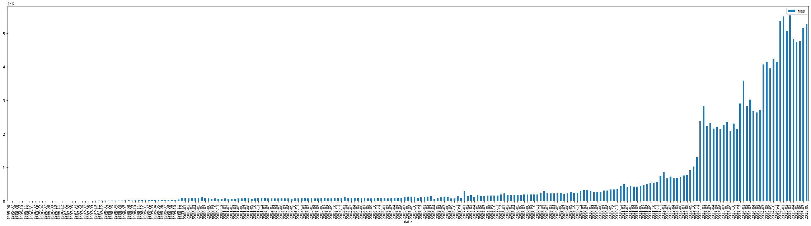
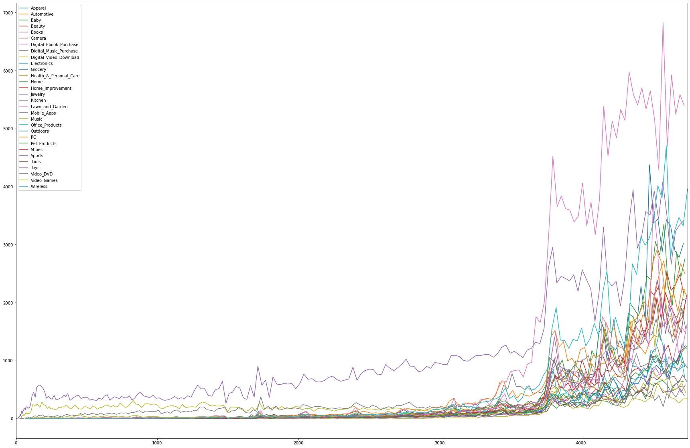
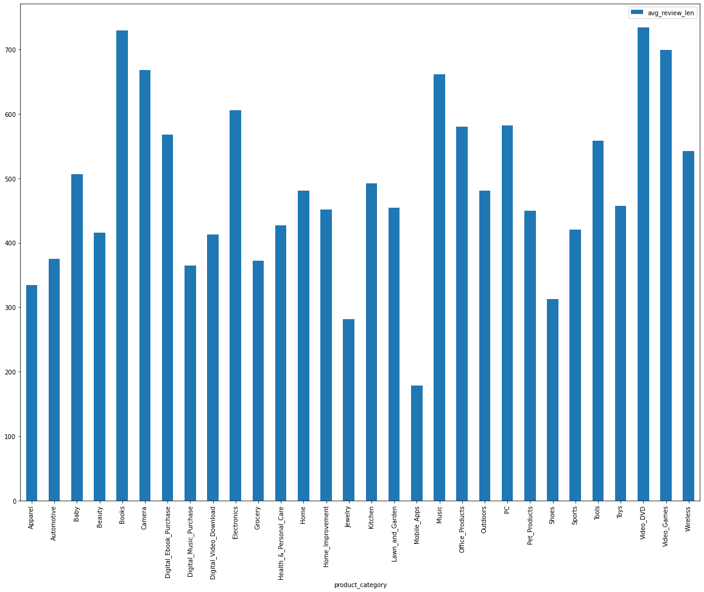
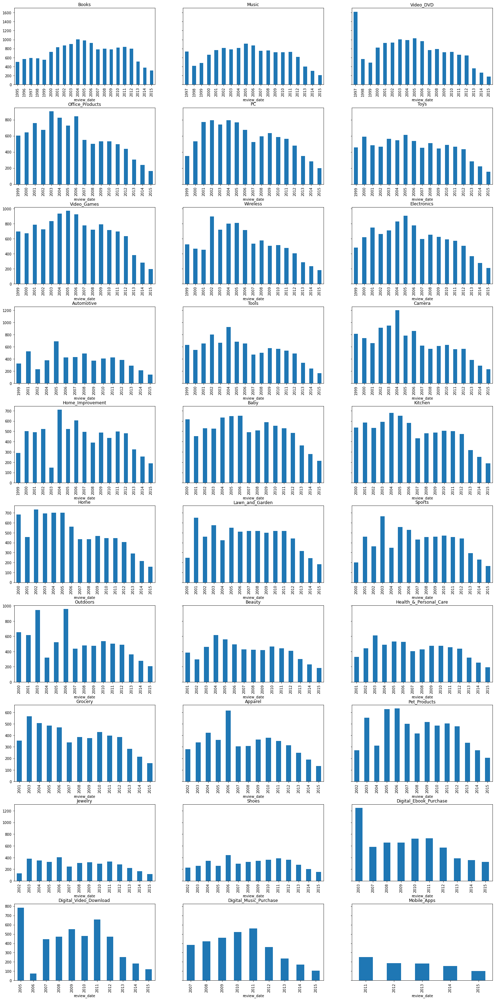
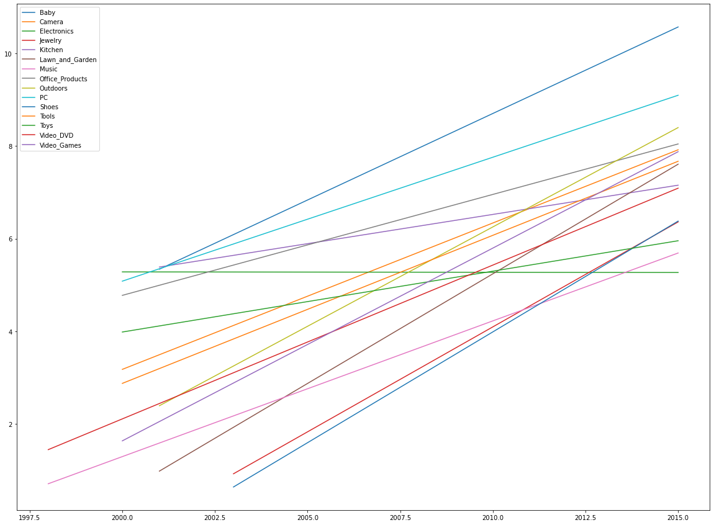

# Practical Guide: Using Product Reviews to Support Internal Customer Operations


## Overview

In the following blog post, we're going to explore how to use AWS to scale data science experiments, with a particular focus on building Text Classifiers for supporting different functions within an organisation.

This blog post is supported by a series of Amazon SageMaker notebooks (which can be find in [this repo] which provide the step-by-step workflow to use very large text datasets for operational purposes, mainly, how to use historical online product customer review data in order to provide predictive capability for identifying product categories, and recommend similar products.

**Use Case Introduction**

The Use Case which will underpin this blog post concerns building a customer support solution, based on customer product reviews [data](https://registry.opendata.aws/amazon-reviews/). Whilst there are many different use cases which can be based on such data, we're going to be focusing on how to use a variety of NLP techniques to help optimize the core functions of an Organisations Customer Support unit. As part of this journey, we're going to navigate this project using a data science framework, which involves data cleansing and preparation, exploration and insights, modelling, scaling, and then operationalization. 

There are several scenarios in which we can explore for this use case, below lists just three which are possible:

 - Incorrect product reviews: customer reviews which are associated with the wrong product can be a time consuming task to track, especially when using manual processes (e.g. Human QA workflows). We can develop automatic processes to predict whether the review added for a specific product (or category of product) is correct, helping reduce some of the human overheads required to support this.
 - Product Categorization - The correct assignment of the product category has several consequences, from technical consequences such as wrongly indexing thus affecting recommendations, to balancing internal product catalogues from a operational perspective. Whilst we can use keywords within the product listing itself to derive the product category, we can also use customer reviews to ensure that the assigned category is suitable, or needs adjusting.
 - Decreasing Product Rating - Reviews could be considered as a good proxy of the sentiment of a product (or category of products), and although we have a star rating with many review systems, the shift in language of a review can help detect if the quality of a product is changing. One technique will be to examine whether the language is shifting overtime.
 
Whilst in this demonstration we're not going to cover all of the use case scenarios, we'll ensure that the solution that we develop is extensible and generalizable to enable more scenarios to be added going forward. 

**Services/Technologies Used**

The use case will use a range of AWS services and technologies, and demonstrate how an organisation can orchastrate different services into a operationalized architecture.


- AWS Glue
- Amazon SageMaker
- Amazon Neptune
- AWS Lambda


**Contents**

- [Data Preparation]() - How to use AWS Glue and SPARK to prepare and process large datasetes ready for analysis
- [Data Experimentation]() - Using Amazon Sagemaker to construct a representative sample of our dataset, and inspect the characteristics of our data. 
- [Model Experimentatio] - Using Amazon SageMaker's built in Algorithms, we'll apply some simple modelling techniques, and then determione which data partitioning / features work best for our tasks.
- [Modelling Scaling]() - Based on the model experiments, we'll scale up the model which yields the most suitable results for our use case
- [Graphing Data]() - Once we've established the correct models to acheive our predictive tasks, we need to find a way to structure our data to address some of the initial asks within the use case defined at the start of the project.
- [Testing Framework]() - One of the critical aspects of introducting a new process within an organisation is to ensure we can test and evaluate our processes when in an operationalized state. This will involve some form of split testing. 
- [Operationalizing]() - Finally, we need to architect our solution in order to ensure we can deploy the solution which can be scaled across an organisation. We'll explore the use of Serverless services such as AWS Lambda and Step Functions to achieve this.


## Data Preparation

Let's first take a look at the data we're going to be using for this Use Case.


### Dataset Details  

> Amazon Customer Reviews (a.k.a. Product Reviews) is one of Amazon’s iconic products. In a period of over two decades since the first review in 1995, millions of Amazon customers have contributed over a hundred million reviews to express opinions and describe their experiences regarding products on the Amazon.com website. This makes Amazon Customer Reviews a rich source of information for academic researchers in the fields of Natural Language Processing (NLP), Information Retrieval (IR), and Machine Learning (ML), amongst others. Accordingly, we are releasing this data to further research in multiple disciplines related to understanding customer product experiences. Specifically, this dataset was constructed to represent a sample of customer evaluations and opinions, variation in the perception of a product across geographical regions, and promotional intent or bias in reviews.

Let's just take a look at what the tablular form of the data looks like to get an understanding of what we're working with.


|marketplace|customer_id|review_id     |product_id|product_parent|product_title                                                                        |product_category|star_rating|helpful_votes|total_votes|vine|verified_purchase|review_headline             |review_body|review_date|
|-----------|-----------|--------------|----------|--------------|-------------------------------------------------------------------------------------|----------------|-----------|-------------|-----------|----|-----------------|----------------------------|-----------------------------------------------------------------------------------------------------------------------------------------------------------------------------------------------------------------------------------------------------------------------------------------------------------------------------------------------------------------------------------------------------------------------------------------------------------------------------------------------------------------------------------------------------------------------------------------------------------------------------------------------------------------------------------------------------------------------------------------------------------------------------------------------------------------------------------------------------------------------------------|-----------|
|US         |22480053   |R28HBXXO1UEVJT|0843952016|34858117      |The Rising                                                                           |Books           |5          |0.0          |0.0        |N   |N                |Great Twist on Zombie Mythos|I've known about this one for a long time, ... |2012-05-03 |
|US         |44244451   |RZKRFS2UUMFFU |031088926X|676347131     |Sticky Faith Teen Curriculum with DVD: 10 Lessons to Nurture Faith Beyond High School|Books           |5          |15.0         |15.0       |N   |Y                |Helpful and Practical       |The student curriculum was better than I expected. The ...|2012-05-03 |
|US         |20357422   |R2WAU9MD9K6JQA|0615268102|763837025     |Black Passenger Yellow Cabs: Of Exile And Excess In Japan                            |Books           |3          |6.0          |8.0        |N   |N                |Paul                        |I found \\"Black Passenger / Yellow Cabs\\" to be a very readable book ... |2012-05-03 |


As we can see from the data table extract above, we have a variety of fields which can be used to filter across, as well as use as features for different analytical insights. 

As with the majority of data science projects which are driven with an underlying business objective, it's important to focus on what information/attributes are goingt to provide the most value and insights to the task at hand. However, selecting such data points, groupings, or segments in the data requires a delicate balance of initial inspection and analysis, hypothesis forming and prooving, as well as a strong level of domain expertise. 

For the purpose of our use case, we're going to initially focus our efforts on several of the attributes in this dataset:

- prodict_cateogry - this represents the higher-order category that a product is assigned to (e.g. Books, Electronics), we will inspect the data to determine how many categories there are (from the dataset description, we can see that they are not extremely granular, which may be useful if we're building multi-class classifiers
- review_body - The main text of the review. This is written by a customer, and describes the customer's feedback and opinion of the product. The review body will be the main feature used in our NLP and classificationt tasks.
- review_date - The date the review was added. This will be useful as we may want to construct temporal views of our data based ont the time it was generated.


### Data Preparation

As we're going to be working with a very large dataset, using the right tool is going to be essential here to view, process, and transform our data to a structure that's suitable for our purpose. We're going to use [AWS Glue](https://aws.amazon.com/glue/) as our environment to process our data, and by doing so, we will be able to use Apache SPARK to process our data. 

For those that are not familar with Apache SPARK, it's simply a large-scale data processing platform/engine, which provides a scalable environment to run very large processing and analytics workloads in. For more details on Spark, see [here](https://spark.apache.org/).

If we navigate to our [Pre-Processing Notebook](), we can see it looks exactly the same as a SageMaker Jupyter Notebook, and that's because it is. The great thing about AWS Glue is that it uses SageMaker Notebooks as the environment to perform your Spark operations; the only difference is that when using AWS Glue, we need to attach a Spark endpoint to a given notebook environment.

Before you can run this notebook, you'll need to have set up your own AWS Glue service via the AWS Console, which will involve configuring your 'Dev Endpoint', and your Notebooks linked to the Dev Endpoint. For more information on setting up your environment, see [here](https://docs.aws.amazon.com/glue/latest/dg/getting-started.html).


**Important Note**: As we're going to be initially working with Spark and AWS Glue, I would recommend creating your Glue Notebook Instance to begin with, and then cloning this repository into your AWS Glue Notebook environment. Once you've completed the Spark processing, it's important to shut down the Dev Endpoint, as this is charged not by usage, but uptime. Your Notebook Instance will still be active after you shutdown your Dev Endpoint, as these are decoupled services.


#### Importing Data and Processing

Our initial workflow is going to involve importing the data from the originating S3 bucket, and then loading it from a Spark RDD, into a PySpark Dataframe so we can process some of the text fields. We could leave it as a RDD, but for easier understanding and alignment with those familar with Pandas DataFrames, we'll use PySpark DataFrames.

```python
reviews = spark.read.parquet("s3://amazon-reviews-pds/parquet")

MIN_SENTENCE_LENGTH_IN_CHARS = 5
MAX_SENTENCE_LENGTH_IN_CHARS = 5000

df = reviews \
  .distinct() \
  .filter("marketplace = 'US'") \
  .withColumn('body_len', F.length('review_body')) \
  .filter(F.col('body_len') > MIN_SENTENCE_LENGTH_IN_CHARS) \
  .filter(F.col('body_len') < MAX_SENTENCE_LENGTH_IN_CHARS) \

record_count = df.count()
print('Total Record Processing: {}'.format(record_count))
```

In the code snippit above, we're simply reading the Amazon Reviews data from Parquet format into our Spark cluster, and then converting it to a PySpark Dataframe, with some simple filters on the length of the length of the review_body text. We do this as we want to ensure that we are working with rows where the reviews are present, and are not the length of several pages. A more robust approach here would be to first select all the reviews, calculate the variance in review_body length, and then use some a suitable range based on some St.d value or orther property.

The output of our processing results in the following:

```sh
Total Record Processing: 148,739,853
```

Depending on the size of the AWS Glue End-point, the processing time will vary. I chose 10 DPUs and it took around 15 minutes.

Next, we're going to process the `review_body` column data, as we want to ensure it is cleaned and ready for use for different NLP tasks. If you've had any experience with text processing for data mining or NLP tasks, then removing terms and tokenizing is typically the first step to readying your data. We're goign to perform some basic stop word removal, stemming, and tokenizing and then add these new filtered reviews to a new column.

In order to make use of Spark's distributed processing capabilities, rather than using `apply` and `lambda` functions on a standard dataframe which executes iteratively (not compute efficient at all!), we're goign to use the `withColumn` pySpark method, and apply several functions to preprocess the data, namely, removing punctuation, stop words, and then tokenizing. As shown in the notebook, we're not using traditional NLP libraries such as NLTK for performing the stopword removal or tokenization, however, it's possible to use this if required,.

```python
df = df.withColumn('review_body_processed', preprocess_text(col('review_body')))
```

The output of this data is a new column called `review_body_processed` which contained a cleaned, tokenized representation of the `review_body` content.

|         review_body | review_body_processed |
|---------------------|---------------------- |
| I have this watch...| \[watch, believe, ... |
| I use this watch ...| \[use, watch, busi... |
| Bought this watch...| \[bought, watch, a... |
| My watch was dead...| \[watch, dead, arr... |
| It is good watch ...| \[good, watch, rec... |
| The watches I bou...| \[watches, bought,... |
| this is a very ni...| \[nice, time, piec... |
| The product is as...| \[product, expecte... |

Great, we're now at the point where we've processed all of our 145 million rows, and ready to store our data for analysis and deeper inspection. However, we probably don't want to store all of the columns for now, only the core attributes which we will use for processing. 

As the review date is going to be can be used as a method to group the datapoints (in addition to the `product_category`), we going to create a column which will represent the `yyyy-mm` of our `review_date`, which will then be used to partition the data (and ultimately store the data in S3 PREFIX's which are labelled by the `yyyy-mm` String.

```python
#convert date to string with format yyyy-mm
func_to_str =  udf (lambda x: datetime.strftime(x, '%Y-%m'))

#apply the udf to the df
df = df.withColumn('review_date_str', func_to_str(col('review_date')))

```

The above code snipping applies (using the `withColumn` method) a [user defined function](https://spark.apache.org/docs/latest/api/python/_modules/pyspark/sql/udf.html) to reformat the `review_date` timestamp, and store it in a new column.

Once that's done, we're able to save the our chosen S3 bucket, partitioned by our new timestamp string. 

```python

#first partition
df = df \
  .repartition("review_date_str")

#then save pyspark df
df \
  .write \
  .partitionBy('review_date_str') \
  .mode('overwrite') \
  .csv("s3://demos-amazon-reviews/preprocessed_reviews_csvs/", header=True)
```

We've now saved our processed data back to S3, using CSV format. It's also possible to save this data to other formats (parquet, tsv, HIVE, etc), but we're goign to use CSV as we're goign to move next to Jupyter and Pandas to explore the data. Also, it's important to note that if we chose a different partitioning strategy, our folder structure would look different, we could even partition by multiple columsn, e.g. timestamp + category, which would then provide a finer level of granularity with regards to our data structure in S3.


**Section Recap**

- Loaded Amazon Reviews Dataset from S3 into Spark using AWS Glue
- Transform the data into Pyspark DataFrames which was filtered using a number of parameters 
- Used Natural Language Techniques to pre-process the data
- Saved the Data back to Amazon S3 for downstream use


## Data Experimentation

Based on the data processed during the first part of this use case, we're now going to explore and interrogate the data to understand how we can work towards achieving our proposed use case. The Data Experimentation [Notebook]() is used to develop a representative sample of the 145 million rows, so we can first perform some local experiments before scaling up our methods to the full dataset. Whilst working with the sample dataset may not always be necessary, it's good practice to first examine different methods against the original hypothesis or business objective to understand which methods are going to be suitable going forward. In most cases, when performing rapid prototyping of models, not all aspects will be fleshed out, thus using a sample helps speed up processing, as what we're looking for is an indication that the methods being applied will be suitable, rather than full evaluation of a set of methods (although, depending on the domain, this could be useful).


### Building a Representative Sample

Developing representative samples of a population is a rich area of multi-disciplinary reserarch, and depending on the domain or discipline, the methods used will differ. In this example project, we're going to use a non-probability based sampling method in order to construct a 1% sample of our data (~1.5 million rows). The sample will sample evenly across the time window of reviews (1995-06 to 2015-08), and sample 1% of records from each month. 

However, before we can finalise our sampling strategy, it's import to first understand the count of records across the timeframe collected. To do this, we will run a series of queries across the data residing in S3 to obtain a view of the spread of data. A simple method we can use to get a count of the records per month is by using the `boto3` built in `s3` function, `select_object_context`, which allows us to execute an `SQL` expression on our datafiles in S3:

```python

s3 = boto3.client('s3')
resp = s3.select_object_content(
    Bucket=configs['bucket_name'],
    Key=entry['path_with_prefix'],
    ExpressionType='SQL',
    Expression="SELECT count(*) FROM s3object s",
    InputSerialization = {'CSV':
                          {"FileHeaderInfo": "Use", 
                           "AllowQuotedRecordDelimiter": True,
                           "QuoteEscapeCharacter":"\\",
                          }, 
                          'CompressionType': 'NONE'},
    OutputSerialization = {'CSV':{}},
)

for event in resp['Payload']:
    if 'Records' in event:
        records = event['Records']['Payload'].decode('utf-8')
        return(int(records))

```

Using the `count()` syntax, we're able to obtain a quick view of the absolute count of each month's records, without having to transfer our data to our SageMaker instance, then load it into a dataframe, or perform some other shell based operation (e.g. `wc -l`). Note we do this using Spark in our previous step, but we're including this in the sample notebook to keep processing and analysis separate.




Now we're aware of the distribution of records in our full dataset, we can build our representative sample. To to this, we're going to first use the count of rows in each month, and find the number of rows which represent the 1% sample. e.g.

```
rows_to_keep = (total_rows_in_a_month) * fixed_sample_pct
```

Based on the number of rows we need to extract from each month, we will then use an event sampling technique to extract the rows from the CSV files, by using the `nrows` parameter in the `read_csv` method for `pandas`

```python
df = pd.read_csv(S3_PATH_TO_CSV, nrows=int(rows_to_keep), header=0, error_bad_lines=False, escapechar="\\")
```

Putting this all together, we end up with the `generate_sample_method` to create our sample which we will use for the rest of the analysis.

```python
def generate_sample_dataset(configs, manifest, manifest_df_stats, sample_size_pct = 0.01):

    dfs_sampled = []
    index_key = configs['index_key']+'='

    sample_meta = {}
    #we take a pct of each of the rows, and then use random to select within each bin
    #workout the overall pct we need to take
    for idx,row in manifest_df_stats.iterrows():
        to_sample = int(row['files'] * sample_size_pct)
        if to_sample < 1:
            to_sample = 1
        date = row['date']    
        tmp = {'rows':row['files'], 'samples': to_sample, 'sampled_added':0}
        sample_meta[date] = tmp

    #now we generate a new manifest
    sampled_manifest = []
    for entry in manifest:

        date = entry['path'].split('/')[1].replace(index_key,'')
        #get the meta data 
        meta = sample_meta[date]
        to_skip = meta['samples']
        if to_skip == 1:
            to_skip = 1
        full_path = 's3://'+configs['bucket_name']+'/'+entry['path_with_prefix']
        df = pd.read_csv(full_path, nrows=int(to_skip), header=0, error_bad_lines=False, escapechar="\\")
        dfs_sampled.append(df)
        
    sampled_data = pd.concat(dfs_sampled)    
    return sampled_data
```

As we're going to be using this sampled data in different SageMaker Notebooks, and the processing of this data takes time to complete (~10 mins), it's good practice to save the data to the local SageMaker instance, so we can reload it from local when required, rather than reprocessing the data:

```python
def save_load_sample_df_to_file(df, path = 'data', file_name_prefix='', operation='save', chunkSize = 100000):
    loaded = []
    #first split the df as it's too big probably
    listOfDf = list()
    if operation == 'save':

        numberChunks = len(df) // chunkSize + 1
        for i in range(numberChunks):
            listOfDf.append(df[i*chunkSize:(i+1)*chunkSize])
            
        for i in range(0, len(listOfDf)):
            chunk_df = listOfDf[i]
            df_tmp_name_prefix = '{}/{}_part_{}.pkl'.format(path, file_name_prefix, str(i))
            chunk_df.to_pickle(df_tmp_name_prefix) 
                       
        return df
                       
    if operation == 'load':
        root_name = '{}/{}_*.pkl'.format(path, file_name_prefix)
        files = glob.glob(root_name)
        for fl in files:       
            print(fl)
            df = pd.read_pickle(fl)
            loaded.append(df)
                       
        return pd.concat(loaded)
    
```

Note with the above save/load method, chunking of the saved file is used as there are filesystem limitations when saving files larger than 4Gb.

Finally, before we analyse the characteristics of the data, we need to ensure our DataFrame columns are correct, and we do a few final checks on the data to ensure that we don't encounter modelling issues going downstream.

```python
def ready_sample_data(df):
    
    print('Dataset Rows {}, Columns {}'.format(df.shape[0], df.shape[1]))
    df['review_date']= pd.to_datetime(df['review_date']) 
    #convert date to string with format yyyy-mm
    df['review_date_str'] = df['review_date'].dt.strftime('%Y-%m')
    
    #here we need to do some basic filtering of rows, we don't want to start to model for 
    df_len = df.shape[0]
    pct_min = 0.01
    min_product_category_row_count = df_len * pct_min 
    
    df = df.groupby('product_category').filter(lambda x : len(x)>min_product_category_row_count)
    return df
  
```

To ensure our sampling methods didn't cause problems with representing the different `product_category` labels, we do a simple filter by groups (grouped by the `product_category`), and then if the total number of rows in a group is less than 1% of the sample records, we drop the group. 

Our final sample dataset, based on the parameters above:

```sh
After Processing Data: Dataset Rows 1,437,684 (49,609 records Dropped), Columns 19 
```

### Analysis and Inspection of the Data

The initial analysis of the data will involve some simple transformations of the data to reveal the properties realted to the number of reviews per `product_category` label, the number of unqiue products within a given timewindow, and the number of reviews associated with a product. This will give us a good indicator on the reviews available across the different cateogories, and the spread of reviews across the products listed. Whilst this is not an exhaustive list of ways to analysis the data from a descriptive perspective, it does provide a first level of analysis, based on the sampling strategy which we have devised.

To generate our analytical dataset, we're going to use some simple techniques to construct a an object which will hold all of our stats, which we can then transform into a dataframe and apply some operations to it to derive new insights. Although it is possible to do acheive the same results with groupings using Pandas native methods, the approach of constructing a statistical dataframe derived from the data allows for persistence, e.g. the data can be saved for future inspection and comparison.

The full details of using this approach can be found in the `analyse_sample_dataset` method, but let's take a quick look one transformion:

```python

tmps = []

#Group by the columns
for name,group in df.groupby(['review_date_str','product_category']):

    #Create a list of unique products
    unique_products = len(group['product_id'].unique().tolist())
    
    #calculate the value of products which have more than one review
    products_with_multiple_reviews = group.shape[0]- unique_products
    
    #add the values to a tmp object
    tmp = {'review_date': name[0],
           'product_category': name[1], 
           'entries':group.shape[0], 
           'unique_products':unique_products,
          'products_with_multiple_reviews':products_with_multiple_reviews 
          }
    tmps.append(tmp)
    
#create a dataframe from our stats
df_counts_cat_years = pd.DataFrame(tmps)

```

Using the above code snippit we're able to now generate a new view of our data for analysis:

|entries |product_category  |products_with_multiple_reviews|review_date    |unique_products|
|--------|------------------|------------------------------|---------------|---------------|
|1209    |Outdoors          |69                            |2015-08-01     |1140           |
|2131    |PC                |306                           |2015-08-01     |1825           |
|1242    |Pet_Products      |84                            |2015-08-01     |1158           |
|2119    |Shoes             |18                            |2015-08-01     |2101           |
|2069    |Sports            |73                            |2015-08-01     |1996           |
|636     |Tools             |41                            |2015-08-01     |595            |
|1629    |Toys              |54                            |2015-08-01     |1575           |
|878     |Video_DVD         |17                            |2015-08-01     |861            |
|340     |Video_Games       |26                            |2015-08-01     |314            |
|3954    |Wireless          |508                           |2015-08-01     |3446           |

Which can be quite easily visualized to help inspect a wider timewindow





Another source of analysis would be to inspec the `review_body` attribute, to understand how the reviews length differ, with respect to the timeframe, and the `product_categoy`. We can use the same methodology as before to construct a view of this data to provide insight into this. Like before, we're going to group our data and start to generate new counts based on the properties of the `review_body` attribute. 

Our first inspection would be to examine the mean length of review comments per category:





And then we can drill down further to understand how this changes, with respect to the temporal characteristics:

 <!-- .element height="25%" width="25%" -->

We're now starting to get a better understanding of the content of our data, how data points within the  `product_cateogry` groups differ, and how this may affect our use of the data for modelling. Not all product categories existed during the same time frame, some have more products than others, and with respect to the review_body, the length of reviews (chars) differen amongst categories. 

Whilst more detailed inspection and evaluation of the data is required - we've only used a few of the attributes so far - the purpose of this section is to demonstrate how to use descriptive views of the data to gather insights, and made the first-level judgment on the data. We're also able to iterate on some of our initial hypothesis and assumptions, and revist the business objectives once again to ensure we're able to delivery what was initially set out.

Let's now move onto the next step in our process which will be to develop some initial models to determine whether the `review_body` data can be used for predictive tasks.

**Section Recap**

- Developed a representative sampling strategy from our pre-processed data created by our AWS Glue workflow
- Generated our sample dataset and saved it for future use
- Developed a series of descriptive statistics to interrogate the data sample and improved our initial assumptions and hypthesis


## Model Experimentation

In this section we're going to be using the [Model Experimentation]() Notebook to begin to develop richer representations of our data, with the goal of determining the predictive capability of the `review_body` text data for our original use case. We're going to start with first reloading the sample dataset which we created in the previous section, which will be used as the basic of all the models going forward. 

In order to develop a richer understanding of the data we're going to use for modelling purposes, we need to select the right tools to inspec the data. It's also important to build up our understand of the data by using techniques which incrementally increase in complexity. We're going to first start of with using TF-IDF to inspect our data from different dimentions, specifically, with relation to the `product_category`, the timeframe, and the `star_rating` of a reviews. 

### Constructing Labelled Data

In order to use our sample data for future modelling purposes, the first step will be to transform our sample dataset into a structure which only features the attributes we're after. The `transform_data_for_modelling_use` provides the necessary steps to to this, where we'll use the `review_body_processed` column for our modelling purposes. If we recall what we did during the initial pre-processing stage in Spark, we applied some NLP cleaning steps to generate tokens which we can use downstream. Now we get to use them. For our labels, we'll be generating them based on a selection of the attributes which we assume to be correct (e.g. `product_category`, and `star_rating`).

For example, to generate a labelled dataset using the `product_category` attribute as the label:

```python 
#first let's get all our data in correct buckets of features and labels
tmps = list()

#first let's do the year_product-category grouping
for name,group in df.groupby([df['review_date'].dt.year,'product_category']):
    #build our label string
    label = '{}_{}'.format(name[0],name[1])
    tokens = list()
    reviews = group['review_body_processed']
    # reshape the tokens
    for review in reviews:
        res = str(review).strip('][').split(', ') 
        tokens.append(res)
    tmp = {'tokens':tokens, 'label':label }
    tmps.append(tmp)

df_year_product_category = pd.DataFrame(tmps)
    
```

### TF-IDF

TF-IDF is a common methodology for understanding the importance of words/strings within a document, or series of documents. For more information on TF-IDF, take a look [here](http://www.tfidf.com/). 

#### TF-IDF - Product Category Temporal Analysis of Overlapping Terms

For our first experiment, we're going to perform inspect the text in the `review_body` attributes, based on two aspects, the `product_category` and the timeframe in which the reviews were made. We're going to then examine how overtime, the reviews changed in language, which will be derived from the TF-IDF scores. The outcome of this analysis will reveal whether the there is a drastic shift in terms between the review language throuhgout the years, or whether there is a gradual increase in language use over the years (the Homophily effect). Depending on the outcome, we may not be able to build classifiers which group all reviews togerher as a _class_, but instead build a classifier for reviews based on another set of features. 

In order to generate our scores, we first need to transform our data from text, to some numerical representation of counts per term. In order to acheive, this we will use the `CountVectorizer` from `scikit-learn`. As we're going to be using `product_category` or `product_cateogry_star_rating` as our groups (classes), we will only generate scores within each of the groups. For TF-IDF, we will need to create a 'document' of all tokens, and then use that to compute out Term Frequency for the given vectors, and then compute the token's Inverse Document Frequency, which then provides us with the TF-IDF weight of a given token, which we'll use for analysis and modelling. 

```python
data_grouped = dict()

#First Generate our documents per Grouping
for idx,row in df.iterrows(): #iterate the sample DataFrame

    category, sub_cat = generate_label_category(row, grouping_type)
    if category in data_grouped:
        docs = data_grouped[category]
    else:
        docs = list()

    tokens = row['tokens']
    docs_tmp = [" ".join(x) for x in tokens]
    docs = docs + docs_tmp
    data_grouped[category] = docs

#Second, for each of the groups (Categories/categories_ratings), find the TF IDF Scores.
tfidf_handlers = dict()
for k,v in data_grouped.items():
    print(k, len(v))
    cv = CountVectorizer(max_features=10000)
    word_count_vector=cv.fit_transform(v)
    feature_names=cv.get_feature_names()
    tfidf_transformer=TfidfTransformer(smooth_idf=True, use_idf=True)
    tfidf_transformer.fit(word_count_vector)
    tfidf_handlers[k] = {'cv': cv, 'feature_names': feature_names, 'tfidf_transformer':tfidf_transformer}

```

Now, as we're interesting in seeing the shift in language overtime, we need to calculate the tf_idf scores for each of the rows in the labelled data dataset, taking into consideration the `product_category` associated with the row, as each product category has it's own previously fitted TF-IDF model. Once we generate the TF-IDF scores, the finally, select the top k keywords for each category at a particular timeinterval.

```python

tfidf_scores = {} #keep track of tf-idf scores for category by year
for idx,row in df.iterrows():

    #Obtain the Category and year Label
    category, sub_cat = generate_label_category(row, grouping_type)
    if category in tfidf_scores:
        sub_scores = tfidf_scores[category]
    else:
        sub_scores = dict()

    #Load the corresponding TF-IDF model which was previoisly generated
    tfidf_transformer=tfidf_handlers[category]['tfidf_transformer']
    feature_names=tfidf_handlers[category]['feature_names']
    cv=tfidf_handlers[category]['cv']
    tokens = row['tokens']
    doc = [" ".join(x) for x in tokens]


    tf_idf_vector=tfidf_transformer.transform(cv.transform(doc))
    
    #sort our vectors by score.
    sorted_items=sort_coo(tf_idf_vector.tocoo())
    
    #use the extrct the top k vectors method 
    keywords=extract_topn_from_vector(feature_names,sorted_items,100)

    
    sub_scores[sub_cat] = keywords
    tfidf_scores[category] = sub_scores

```

We're now in a position to calculate the overlap in TF-IDF scores within each of the `product_category` labels, which will involve performing some simple set comparision usion the `union` function, and then calcuating the percentage of overlap between each of the years.

```python

tfidf_overlaps = []
    for k,v in dic_of_scores.items():
            ordered = OrderedDict(v)
            keys = list(ordered.keys())
            for i in range(0, len(keys)):
                if i < len(keys)-1:
                    year_n = keys[i]
                    year_n1 = keys[i+1]
                    bag = '{}_{}'.format(year_n,year_n1)
                    total_terms = set(ordered[year_n].keys()).union(set(ordered[year_n1].keys()))
                    overlap = set(ordered[year_n].keys()).intersection(set(ordered[year_n1].keys()))
                    pct_overlap = len(overlap) / len(total_terms)*100
                    tmp = {'category':k, 'year_from_to':year_n1, 'overlap_pct':pct_overlap}
                    tfidf_overlaps.append(tmp)
                
    df = pd.DataFrame(tfidf_overlaps)
    
```

Putting all the above snippits of code together, we can now, based on the labels in the dataset, generate our TF-IDF overlap scores.




## Scaling Models

to-Do


## Operationalization


to-Do


